As of the 2018-2019 school year, all WA school districts are now required to submit a 4 year projected budget to the OSPI. 
Summary charts, based on those reports, for the category of General Fund are listed below. 

Note: All bar charts are sorted by dollar amounts, not by district enrollment.
- General Fund 2018-2019 Projected Balance in Total Dollars for All WA School Districts
- General Fund 2019-2020 Projected Balance in Total Dollars for All WA School Districts
- General Fund 2020-2021 Projected Balance in Total Dollars for All WA School Districts
- General Fund 2021-2022 Projected Balance in Total Dollars for All WA School Districts
- General Fund 2021-2022 Projected Balance in Dollars Per Student for All WA School Districts
- General Fund 2021-2022 Projected Balance in Total Dollars Highest 20
- General Fund 2021-2022 Projected Balance in Total Dollars Lowest 20
- General Fund 2021-2022 Projected Balance in Dollars Per Student Highest 20
- General Fund 2021-2022 Projected Balance in Dollars Per Student Lowest 20
- General Fund 2021-2022 Projected Revenues in Dollars Per Student Largest School Districts
- General Fund 2021-2022 Projected Revenues in Dollars Per Student Smallest School Districts
- General Fund 2021-2022 Projected Revenues in Dollars Per Student Mid Sized School Districts

___

General Fund 2018-2019 Projected Balance in Total Dollars for All WA School Districts

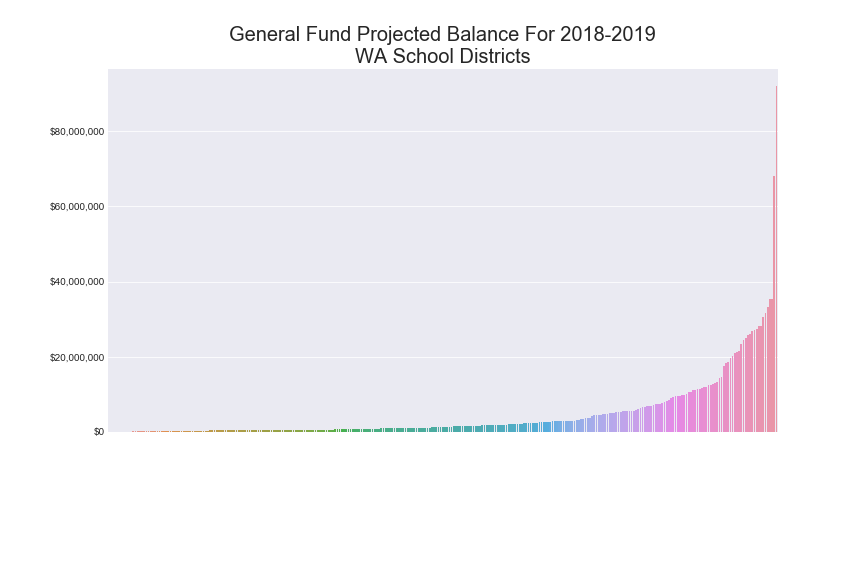

___

General Fund 2019-2020 Projected Balance in Total Dollars for All WA School Districts

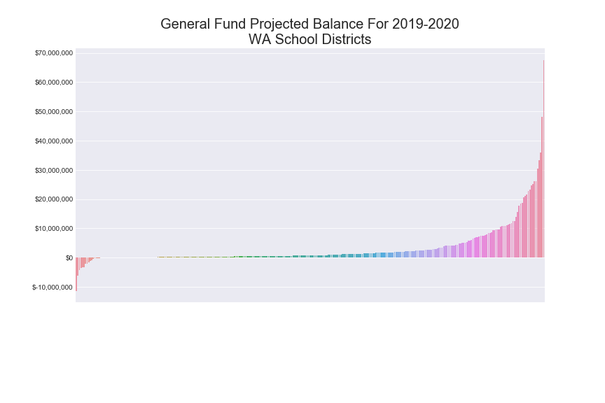

___

General Fund 2020-2021 Projected Balance in Total Dollars for All WA School Districts

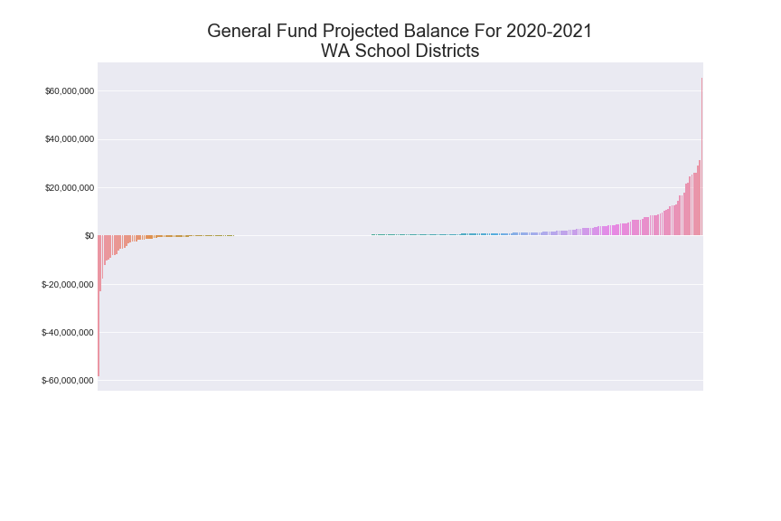

___

General Fund 2021-2022 Projected Balance in Total Dollars for All WA School Districts

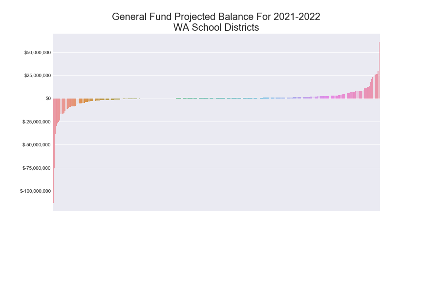

___

General Fund 2021-2022 Projected Balance in Dollars Per Student for All WA School Districts

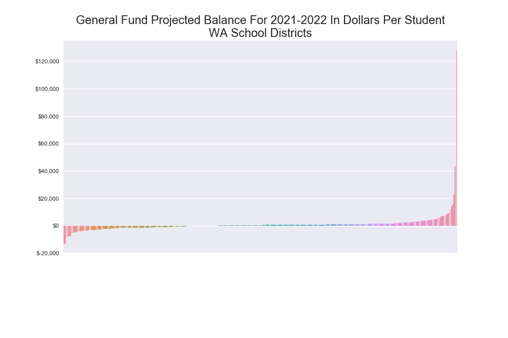

___

General Fund 2021-2022 Projected Balance in Total Dollars Highest 20

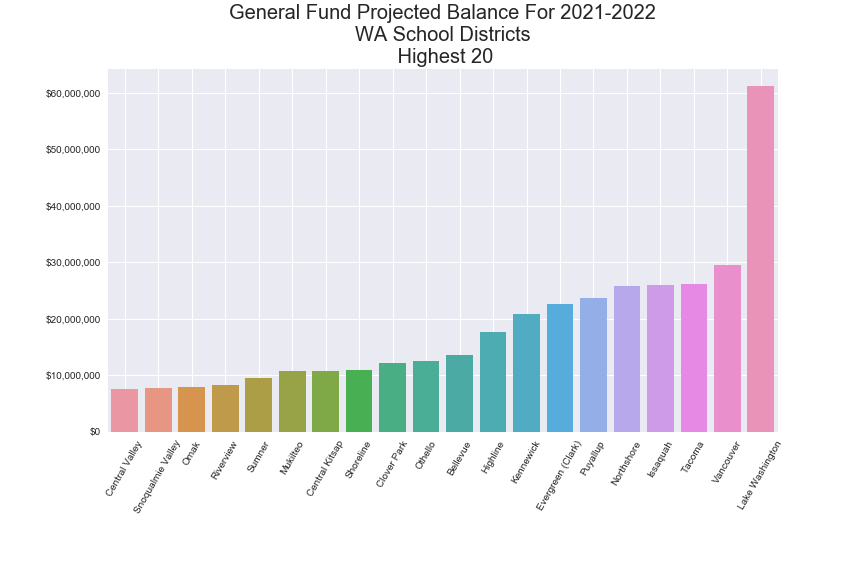

___

General Fund 2021-2022 Projected Balance in Total Dollars Lowest 20

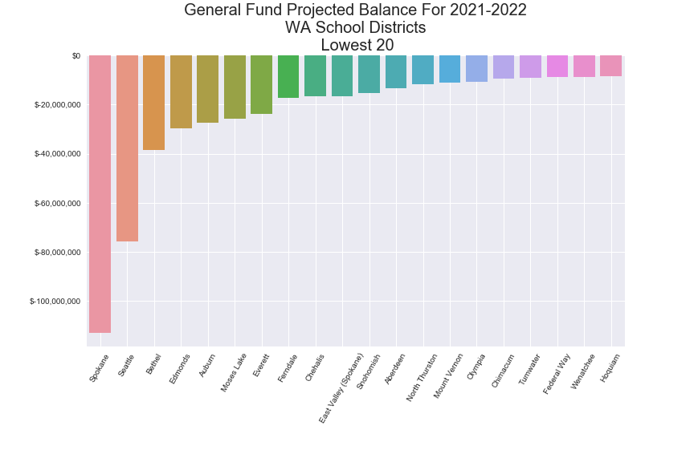

___

General Fund 2021-2022 Projected Balance in Dollars Per Student Highest 20

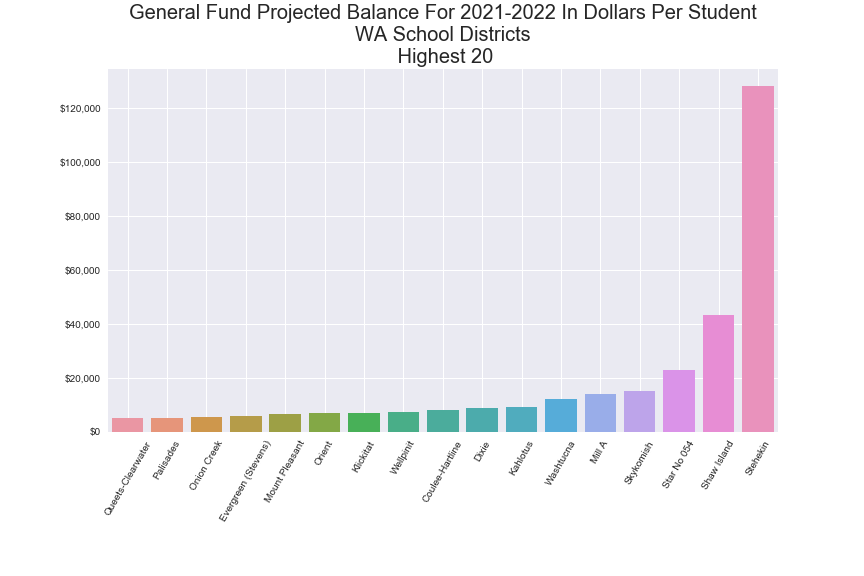

___

General Fund 2021-2022 Projected Balance in Dollars Per Student Lowest 20

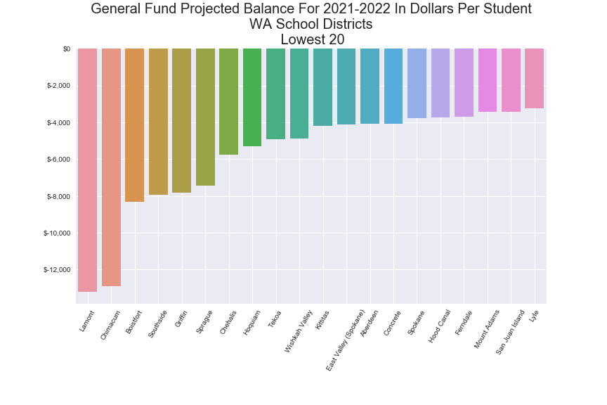

___

General Fund 2021-2022 Projected Revenues in Dollars Per Student Largest Districts

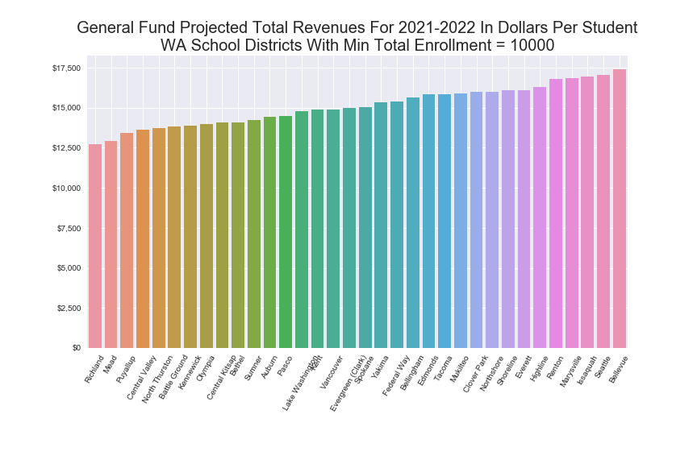

___

General Fund 2021-2022 Projected Revenues in Dollars Per Student Smallest Districts

___

General Fund 2021-2022 Projected Revenues in Dollars Per Student Mid Sized Districts

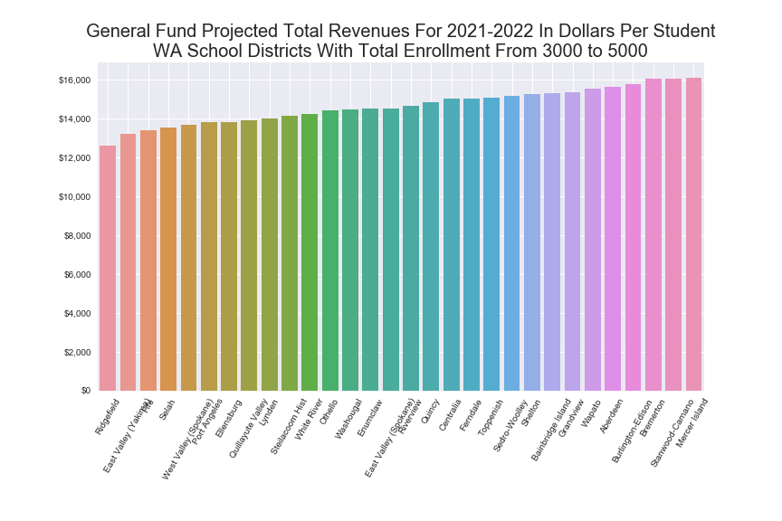

