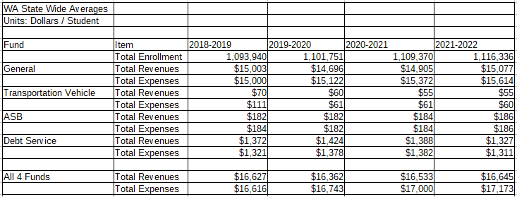
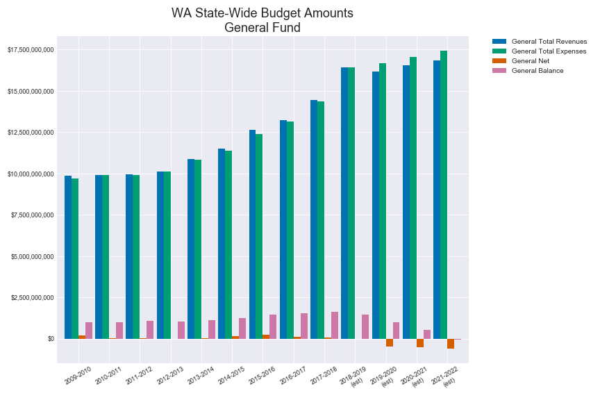
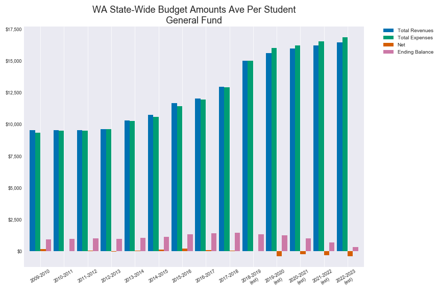
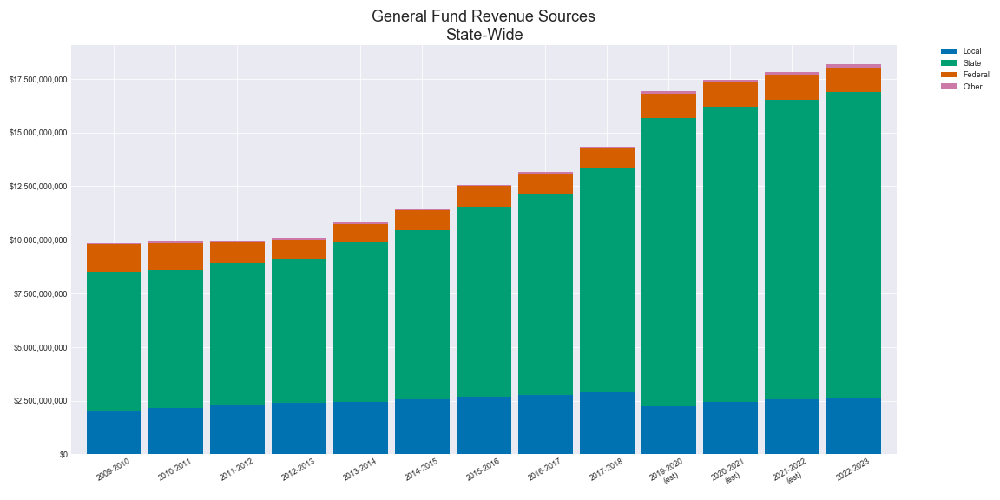
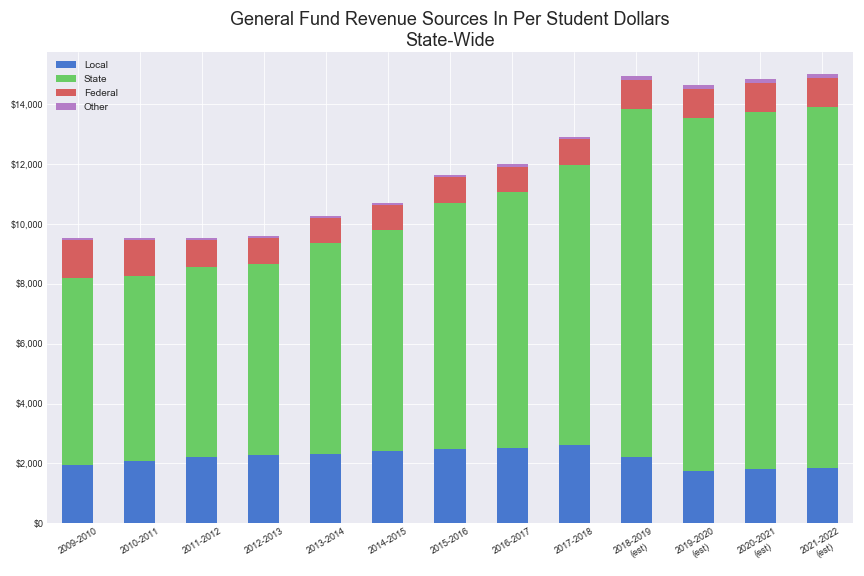
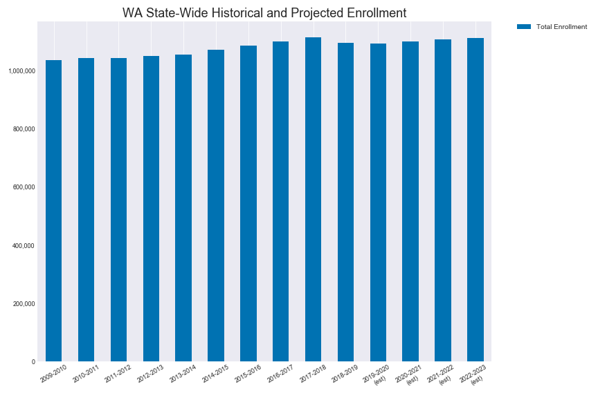
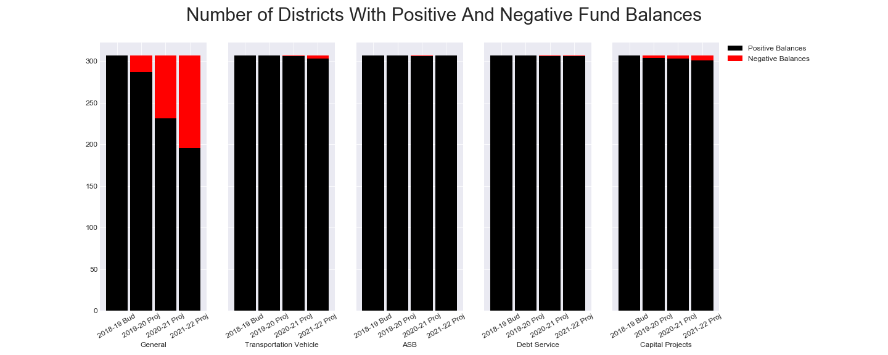

As of the 2018-2019 school year, all WA school districts are now required to submit a 4 year projected budget to the OSPI. 
Summary tables and charts, based on those reports, for revenues and expenses per student are listed below. 

Note: 
- There are 5 types of funds: General Fund, Debt Service Fund, ASB Fund, Transportation Vehicle Fund, Capital Projects Fund 

Tables:
- State-Wide Historical and Projected Ave Revenues and Expenses Per Student by Fund

Charts:
- State-Wide Historical and Projected Budget Amounts for the General Fund
- State-Wide Historical and Projected Budget Amounts Ave Per Student for the General Fund
- State-Wide Historical and Projected Budget Amounts for the General Fund's Revenue Sources
- State-Wide Historical and Projected Budget Amounts Ave Per Student for the General Fund's Revenue Sources
- State-Wide Historical and Projected Enrollment
- Number of Districts with Projected Positive and Negative Balances by Fund

___

State-Wide Historical and Projected Ave Revenues and Expenses Per Student by Fund

___

State-Wide Historical and Projected Budget Amounts for the General Fund

___

State-Wide Historical and Projected Budget Amounts Ave Per Student for the General Fund

___

State-Wide Historical and Projected Budget Amounts for the General Fund's Revenue Sources

___

State-Wide Historical and Projected Budget Amounts Ave Per Student for the General Fund's Revenue Sources

___

State-Wide Historical and Projected Enrollment

___

Number of Districts with Projected Positive and Negative Balances by Fund

There are 307 school districts: 295 regular districts and 12 charter school districts

