As of the 2018-2019 school year, all WA school districts are now required to submit a 4 year projected budget to the OSPI. 
Summary tables and charts, based on those reports, for revenues and expenses per student are listed below. 

Note: 
- All bar charts are sorted by dollar amounts, not by district enrollment.
- Funds included: General Fund, Debt Service Fund, ASB Fund, Transportation Vehicle Fund
- Fund excluded: Capital Projects Fund 

Tables:
- State-Wide Historical and Projected Ave Revenues and Expenses Per Student by Fund

Charts:
- State-Wide Historical and Projected Ave Revenues and Expenses Per Student for the General Fund
- 2018-2019 Estimated Expenses Per Student for All WA School Districts
- 2018-2019 Estimated Expenses Per Student for WA School Districts with Enrollment Range 1 to 100
- 2018-2019 Estimated Expenses Per Student for WA School Districts with Enrollment Range 100 to 250
- 2018-2019 Estimated Expenses Per Student for WA School Districts with Enrollment Range 250 to 500
- 2018-2019 Estimated Expenses Per Student for WA School Districts with Enrollment Range 500 to 800
- 2018-2019 Estimated Expenses Per Student for WA School Districts with Enrollment Range 800 to 1200
- 2018-2019 Estimated Expenses Per Student for WA School Districts with Enrollment Range 1200 to 2500
- 2018-2019 Estimated Expenses Per Student for WA School Districts with Enrollment Range 2500 to 5000
- 2018-2019 Estimated Expenses Per Student for WA School Districts with Enrollment Range 5000 to 10000
- 2018-2019 Estimated Expenses Per Student for WA School Districts with Enrollment Min of 10000

___

State-Wide Historical and Projected Ave Revenues and Expenses Per Student by Fund

___

State-Wide Historical and Projected Ave Revenues and Expenses Per Student for the General Fund

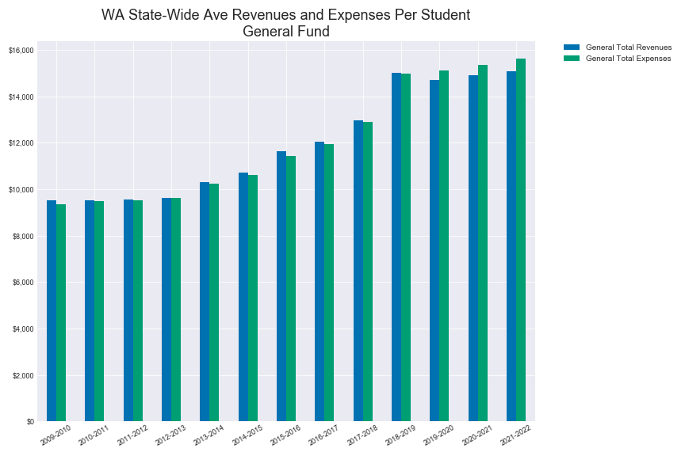

___

2018-2019 Estimated Expenses Per Student for All WA School Districts

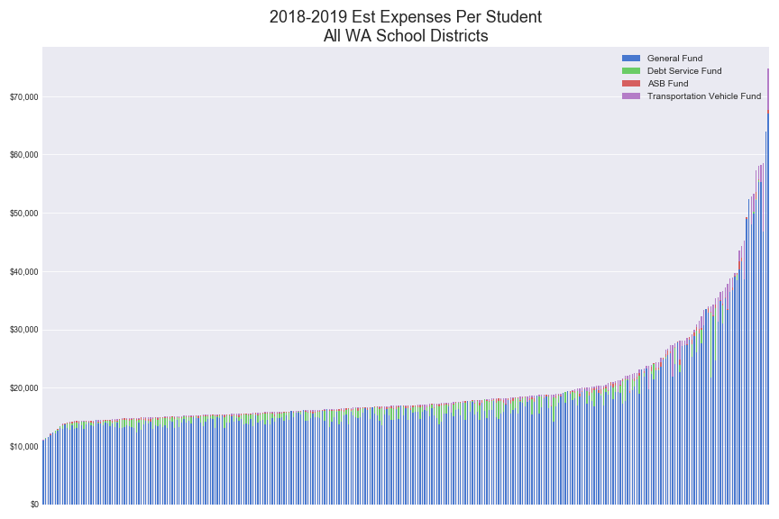

___

2018-2019 Estimated Expenses Per Student for WA School Districts with Enrollment Range 1 to 100

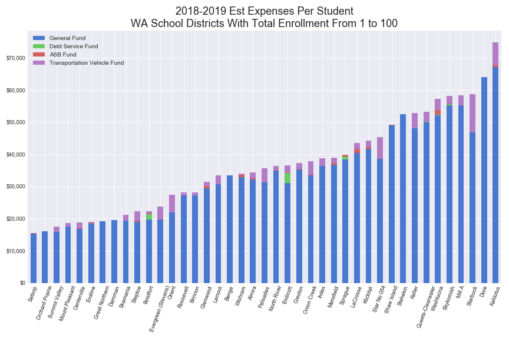

___

2018-2019 Estimated Expenses Per Student for WA School Districts with Enrollment Range 100 to 250

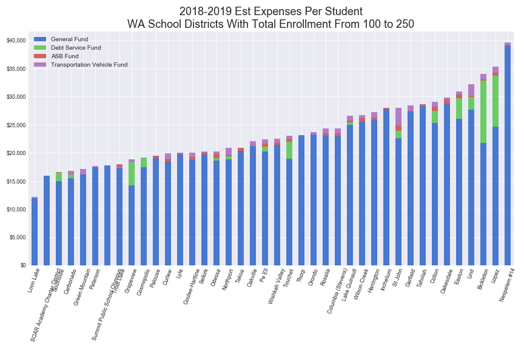

___

2018-2019 Estimated Expenses Per Student for WA School Districts with Enrollment Range 250 to 500

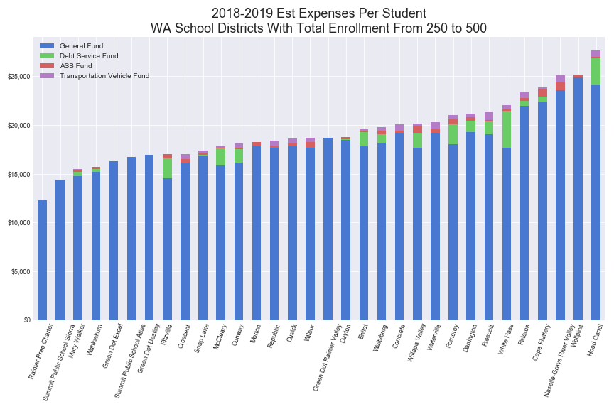

___

2018-2019 Estimated Expenses Per Student for WA School Districts with Enrollment Range 500 to 800

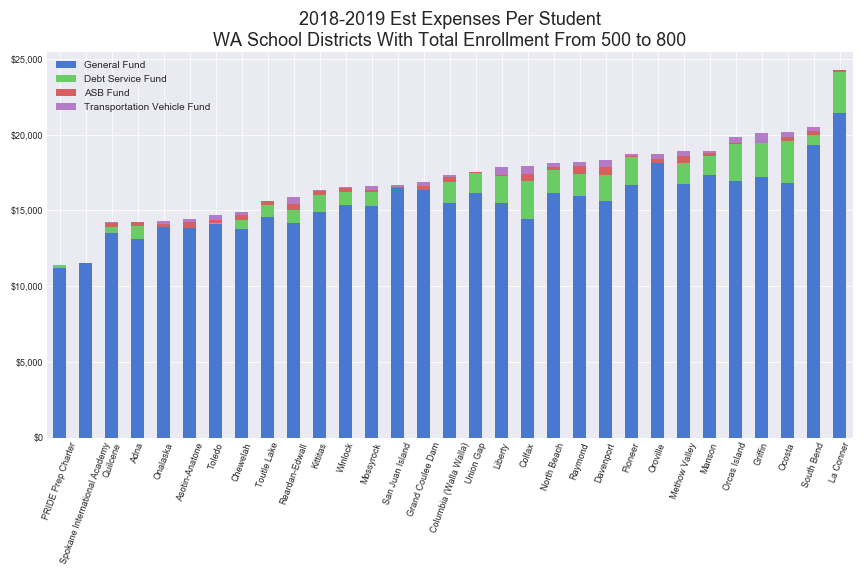

___

2018-2019 Estimated Expenses Per Student for WA School Districts with Enrollment Range 800 to 1200

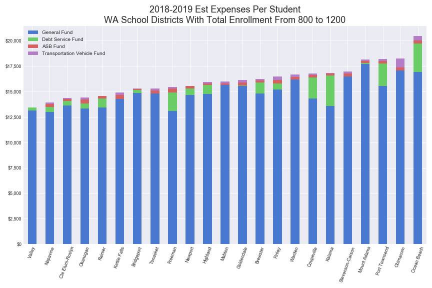

___

2018-2019 Estimated Expenses Per Student for WA School Districts with Enrollment Range 1200 to 2500

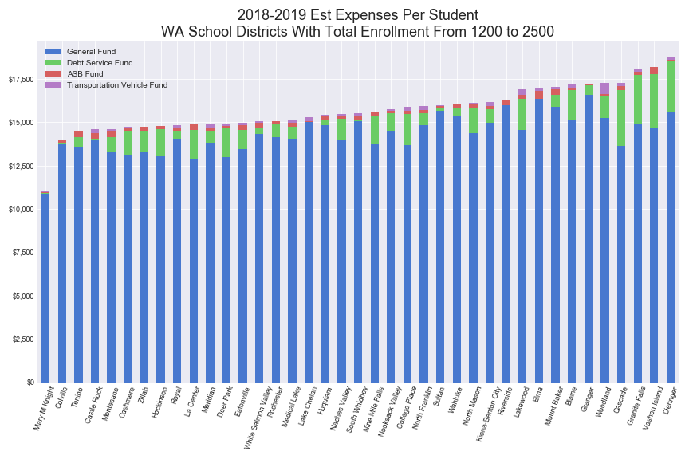

___

2018-2019 Estimated Expenses Per Student for WA School Districts with Enrollment Range 2500 to 5000

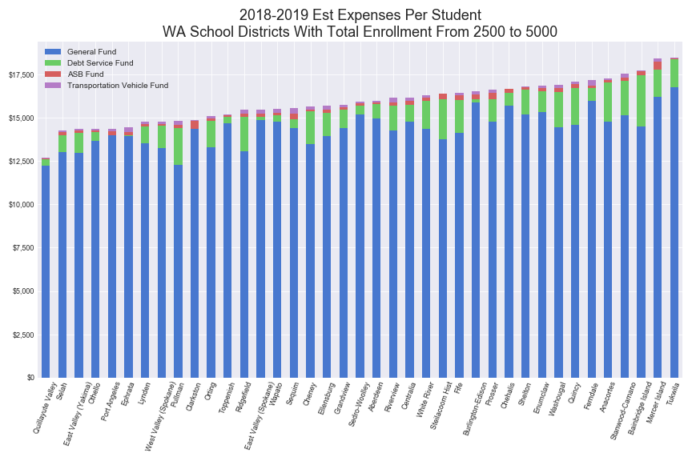

___

2018-2019 Estimated Expenses Per Student for WA School Districts with Enrollment Range 5000 to 10000

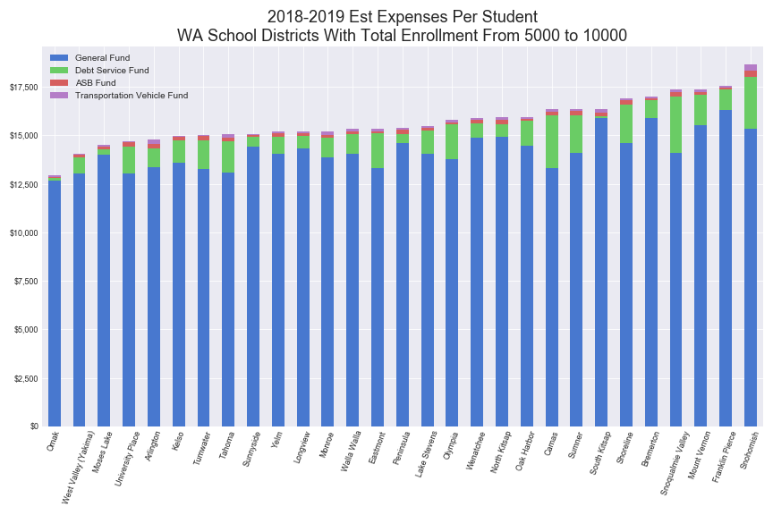

___

2018-2019 Estimated Expenses Per Student for WA School Districts with Enrollment Min of 10000

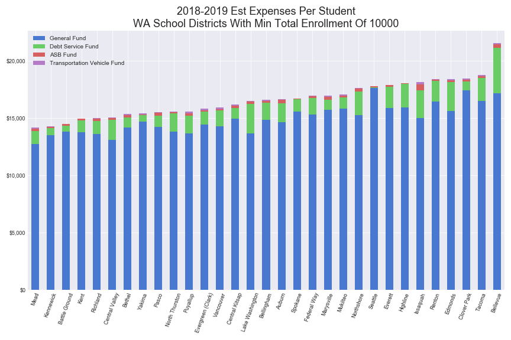

___
