There are 34 different standardized duty titles for WA public school employees. The following charts show the average compensation for the specified duty title at each WA school district.

Note: Each bar in the charts below represents one of the WA school districts with one or more personnel for the respective duty title.

___

Aide
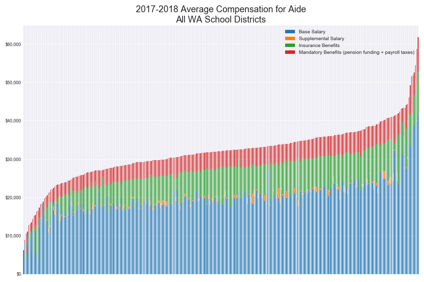
[ Show details for the top districts](pagesManual/DutyTitleCompensation/Average Compensation for AideTop 20 Districts.png "Aide details at top districts")

___

Contractor Teacher
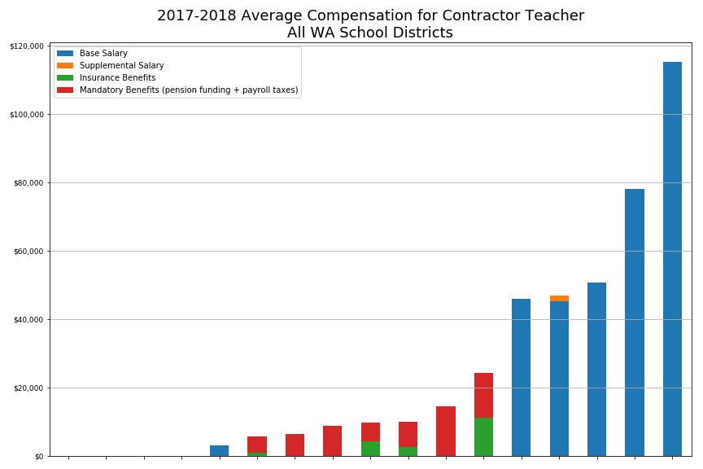
[ Show details for the top districts](pagesManual/DutyTitleCompensation/Average Compensation for Contractor TeacherTop 20 Districts.png "Contractor Teacher details at top districts")

___

Counselor
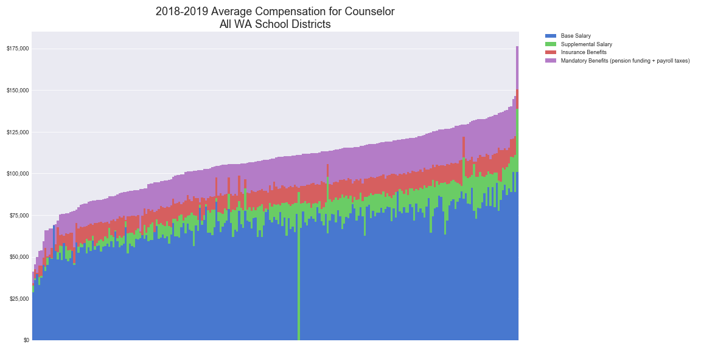
[ Show details for the top districts](pagesManual/DutyTitleCompensation/Average Compensation for CounselorTop 20 Districts.png "Counselor details at top districts")

___

Crafts-Trades
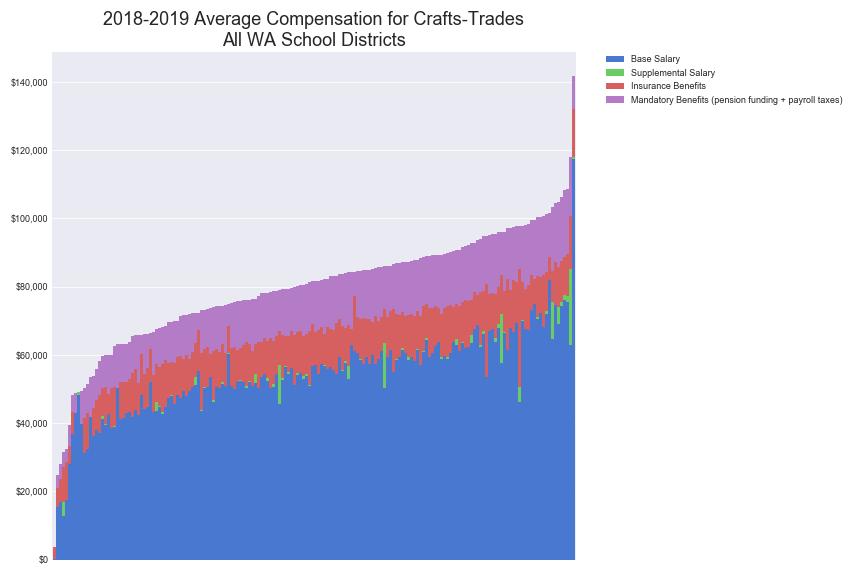
[ Show details for the top districts](pagesManual/DutyTitleCompensation/Average Compensation for Crafts-TradesTop 20 Districts.png "Crafts-Trades details at top districts")

___

Deputy-Assist. Supt.
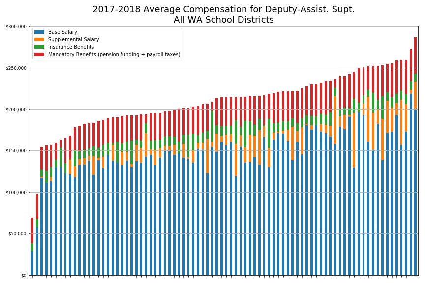
[ Show details for the top districts](pagesManual/DutyTitleCompensation/Average Compensation for Deputy-Assist. Supt.Top 20 Districts.png "Deputy-Assist. Supt. details at top districts")

___

Director-Supervisor
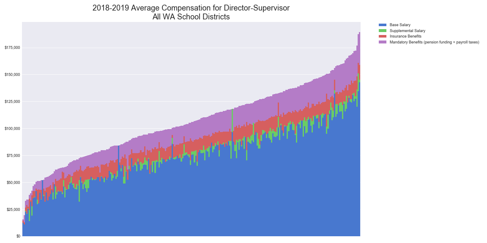
[ Show details for the top districts](pagesManual/DutyTitleCompensation/Average Compensation for Director-SupervisorTop 20 Districts.png "Director-Supervisor details at top districts")

___

Elem. Homeroom Teacher
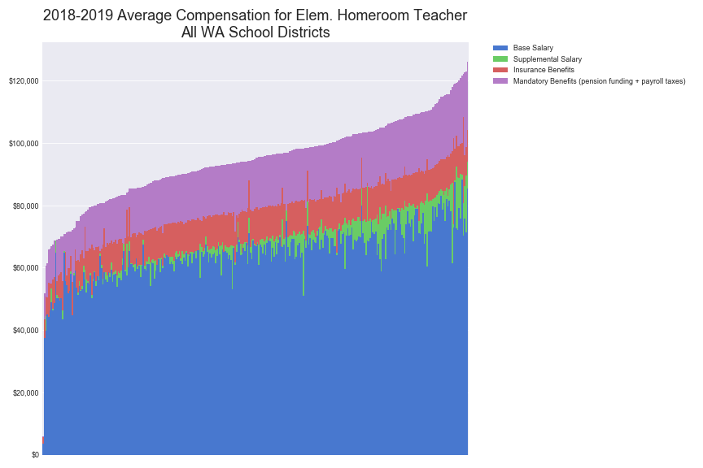
[ Show details for the top districts](pagesManual/DutyTitleCompensation/Average Compensation for Elem. Homeroom TeacherTop 20 Districts.png "Elem. Homeroom Teacher details at top districts")

___

Elem. Specialist Teacher
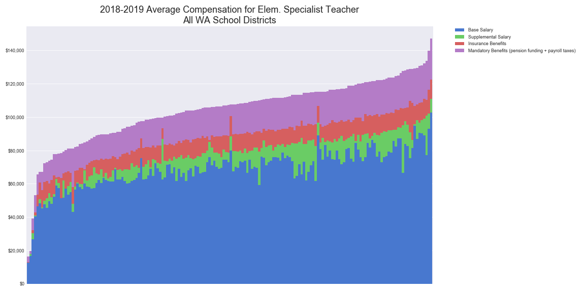
[ Show details for the top districts](pagesManual/DutyTitleCompensation/Average Compensation for Elem. Specialist TeacherTop 20 Districts.png "Elem. Specialist Teacher details at top districts")

___

Elem. Vice Principal
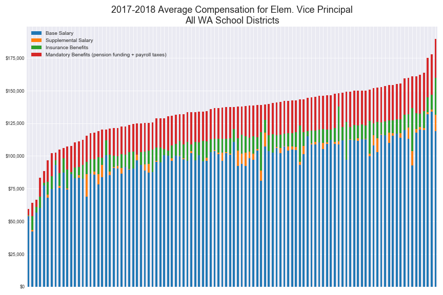
[ Show details for the top districts](pagesManual/DutyTitleCompensation/Average Compensation for Elem. Vice PrincipalTop 20 Districts.png "Elem. Vice Principal details at top districts")

___

Elementary Principal
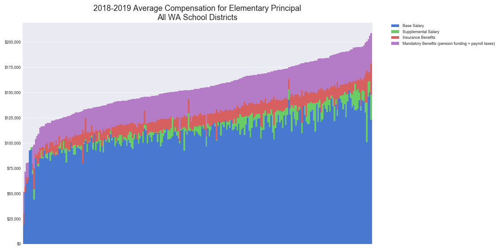
[ Show details for the top districts](pagesManual/DutyTitleCompensation/Average Compensation for Elementary PrincipalTop 20 Districts.png "Elementary Principal details at top districts")

___

Extracurricular
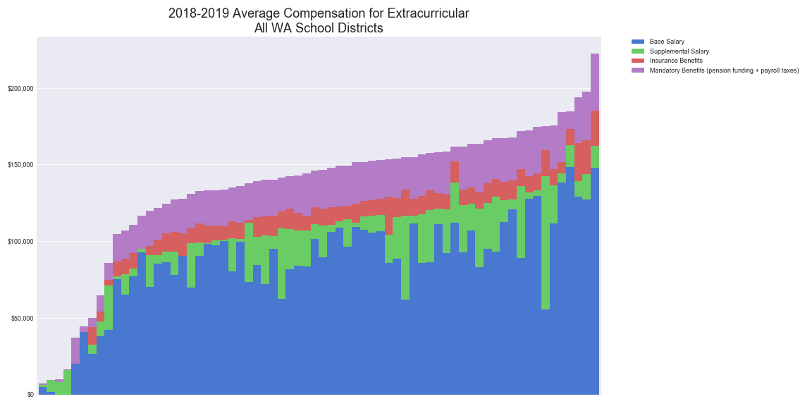
[ Show details for the top districts](pagesManual/DutyTitleCompensation/Average Compensation for ExtracurricularTop 20 Districts.png "Extracurricular details at top districts")

___

Laborer
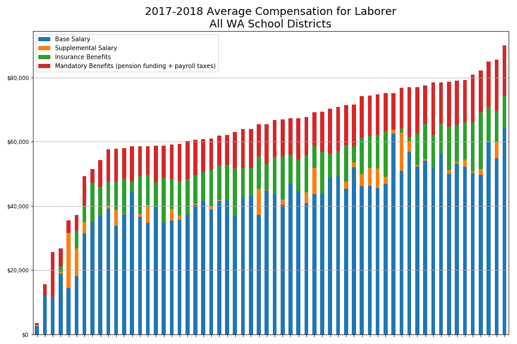
[ Show details for the top districts](pagesManual/DutyTitleCompensation/Average Compensation for LaborerTop 20 Districts.png "Laborer details at top districts")

___

Library Media Specialist
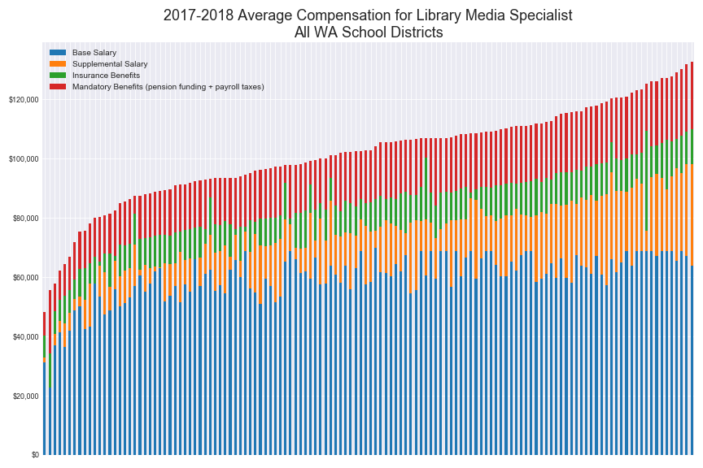
[ Show details for the top districts](pagesManual/DutyTitleCompensation/Average Compensation for Library Media SpecialistTop 20 Districts.png "Library Media Specialist details at top districts")

___

Nurse
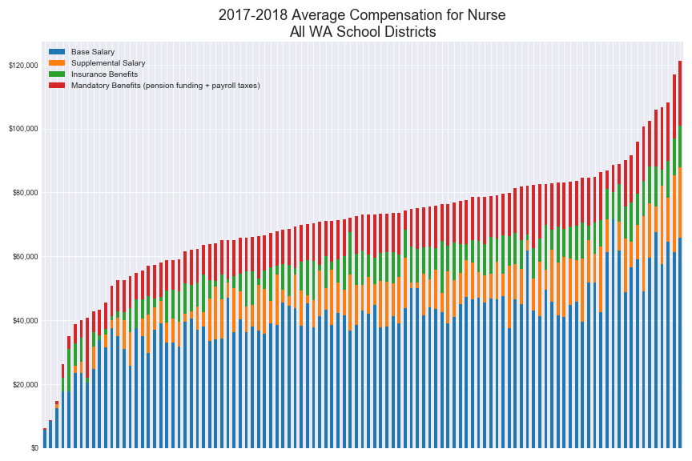
[ Show details for the top districts](pagesManual/DutyTitleCompensation/Average Compensation for NurseTop 20 Districts.png "Nurse details at top districts")

___

Occupational Therapist
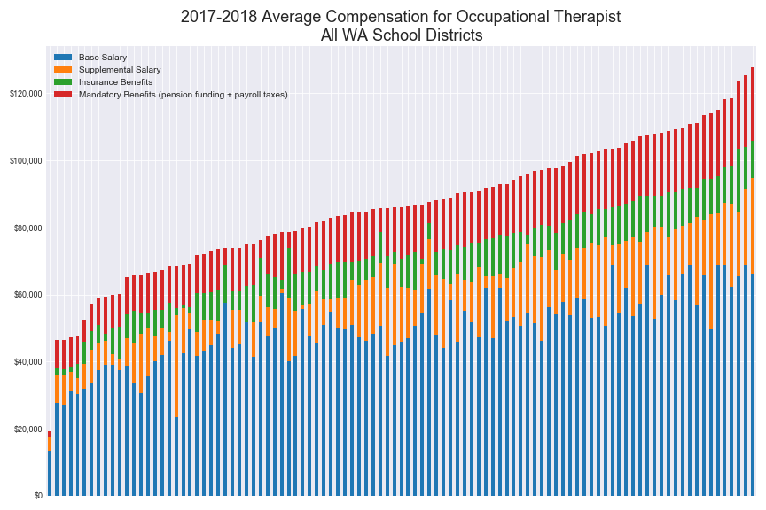
[ Show details for the top districts](pagesManual/DutyTitleCompensation/Average Compensation for Occupational TherapistTop 20 Districts.png "Occupational Therapist details at top districts")

___

Office-Clerical
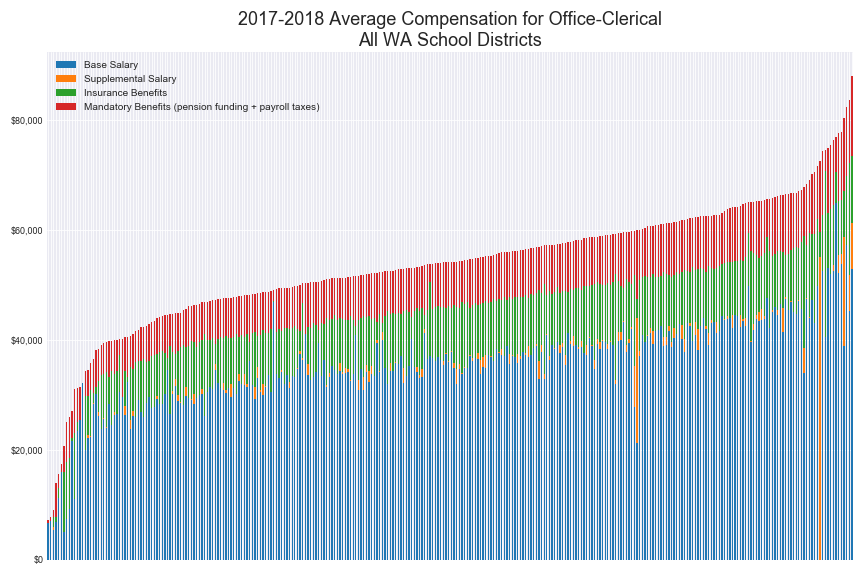
[ Show details for the top districts](pagesManual/DutyTitleCompensation/Average Compensation for Office-ClericalTop 20 Districts.png "Office-Clerical details at top districts")

___

Operator
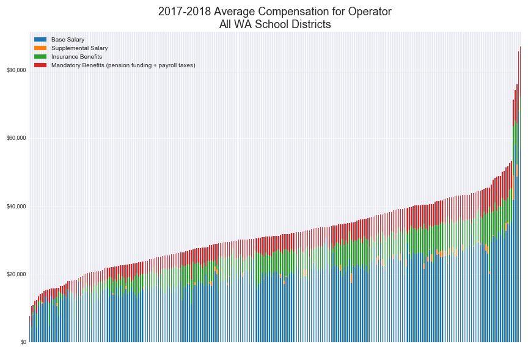
[ Show details for the top districts](pagesManual/DutyTitleCompensation/Average Compensation for OperatorTop 20 Districts.png "Operator details at top districts")

___

Other District Admin.
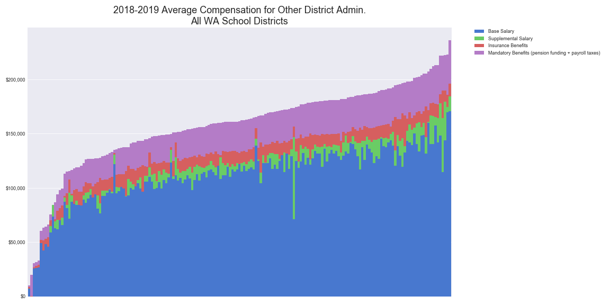
[ Show details for the top districts](pagesManual/DutyTitleCompensation/Average Compensation for Other District Admin.Top 20 Districts.png "Other District Admin. details at top districts")

___

Other School Admin.
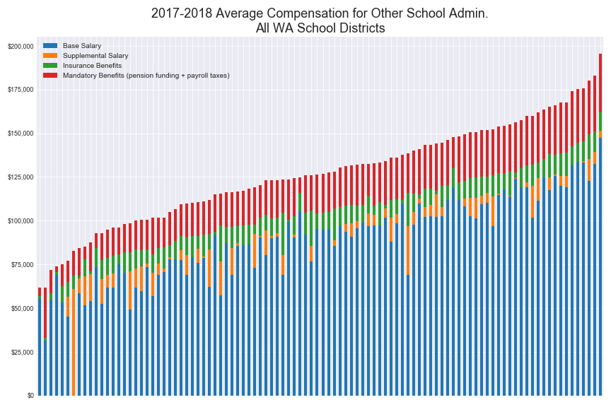
[ Show details for the top districts](pagesManual/DutyTitleCompensation/Average Compensation for Other School Admin.Top 20 Districts.png "Other School Admin. details at top districts")

___

Other Support Personnel
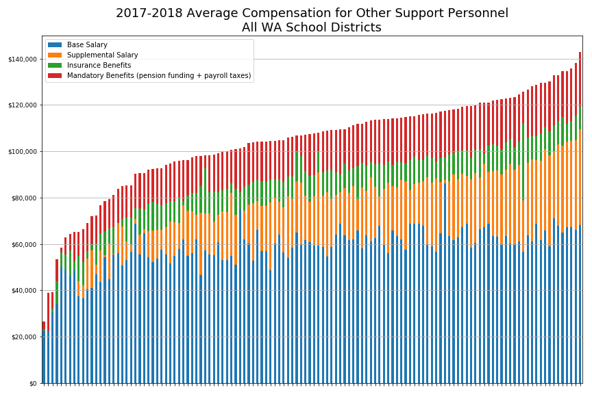
[ Show details for the top districts](pagesManual/DutyTitleCompensation/Average Compensation for Other Support PersonnelTop 20 Districts.png "Other Support Personnel details at top districts")

___

Other Teacher
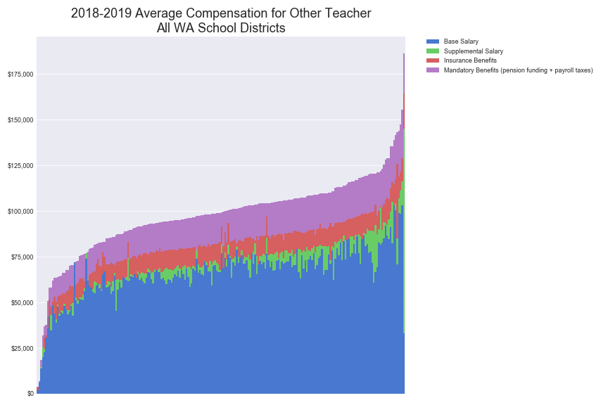
[ Show details for the top districts](pagesManual/DutyTitleCompensation/Average Compensation for Other TeacherTop 20 Districts.png "Other Teacher details at top districts")

___

Physical Therapist

[ Show details for the top districts](pagesManual/DutyTitleCompensation/Average Compensation for Physical TherapistTop 20 Districts.png "Physical Therapist details at top districts")

___

Professional
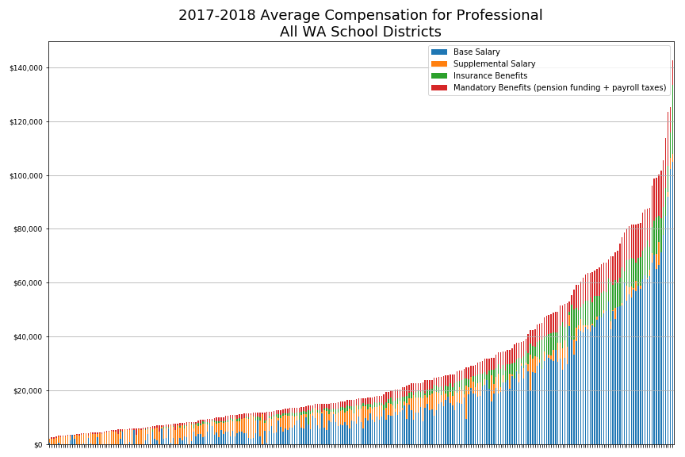
[ Show details for the top districts](pagesManual/DutyTitleCompensation/Average Compensation for ProfessionalTop 20 Districts.png "Professional details at top districts")

___

Psychologist
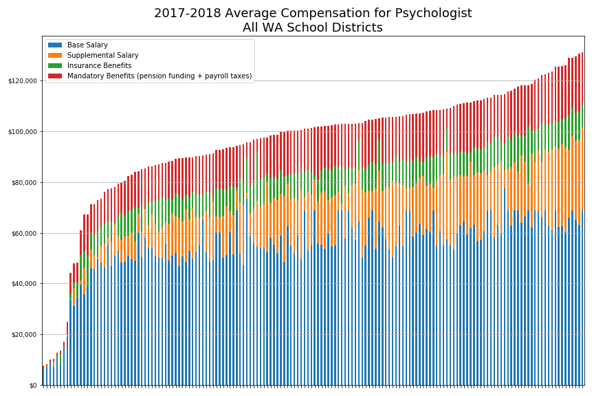
[ Show details for the top districts](pagesManual/DutyTitleCompensation/Average Compensation for PsychologistTop 20 Districts.png "Psychologist details at top districts")

___

Reading Resource Spec.
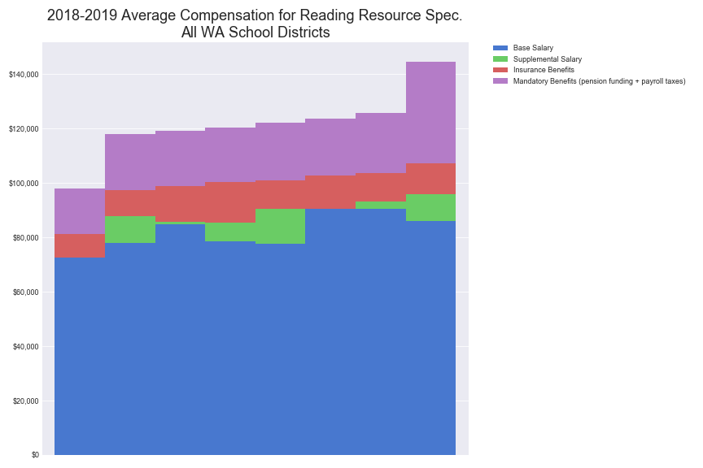
[ Show details for the top districts](pagesManual/DutyTitleCompensation/Average Compensation for Reading Resource Spec.Top 20 Districts.png "Reading Resource Spec. details at top districts")

___

Secondary Principal

[ Show details for the top districts](pagesManual/DutyTitleCompensation/Average Compensation for Secondary PrincipalTop 20 Districts.png "Secondary Principal details at top districts")

___

Secondary Teacher
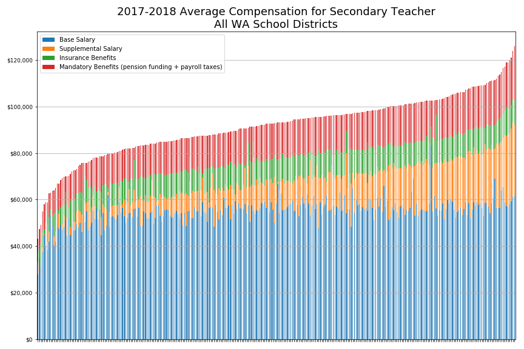
[ Show details for the top districts](pagesManual/DutyTitleCompensation/Average Compensation for Secondary TeacherTop 20 Districts.png "Secondary Teacher details at top districts")

___

Secondary Vice Principal
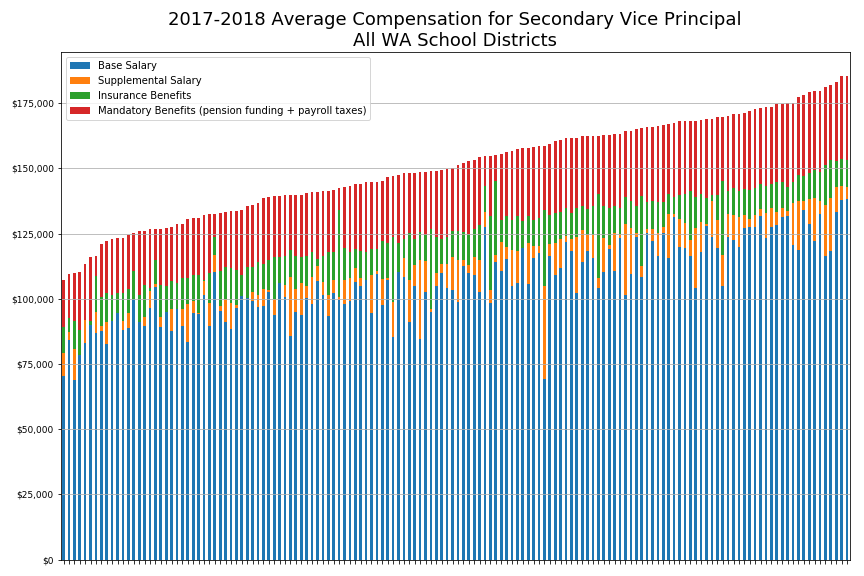
[ Show details for the top districts](pagesManual/DutyTitleCompensation/Average Compensation for Secondary Vice PrincipalTop 20 Districts.png "Secondary Vice Principal details at top districts")

___

Service Worker
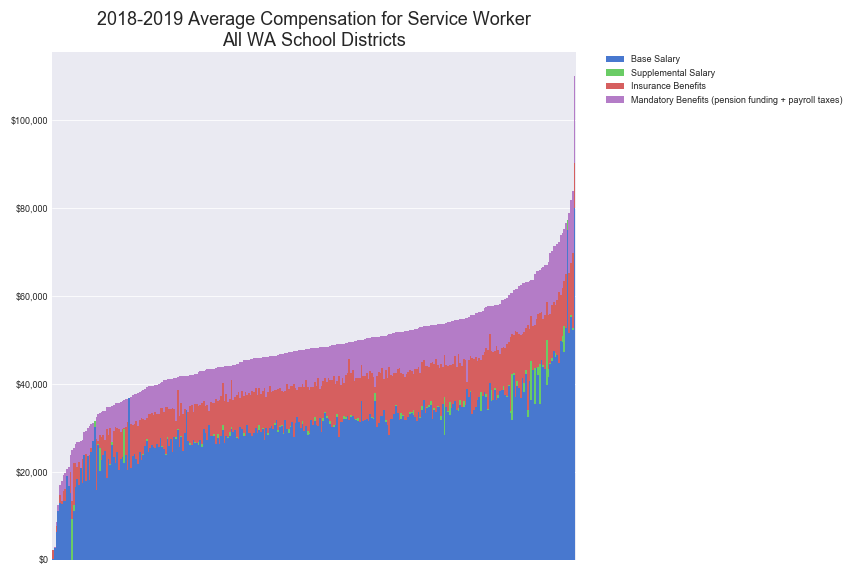
[ Show details for the top districts](pagesManual/DutyTitleCompensation/Average Compensation for Service WorkerTop 20 Districts.png "Service Worker details at top districts")

___

Social Worker
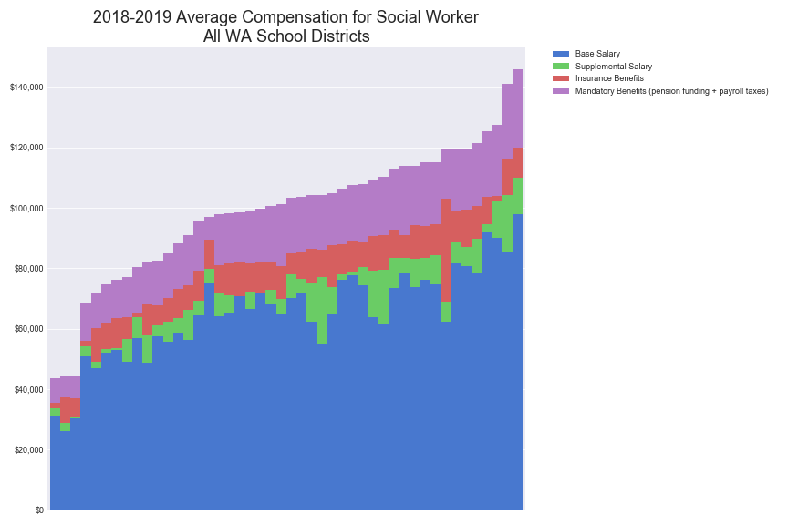
[ Show details for the top districts](pagesManual/DutyTitleCompensation/Average Compensation for Social WorkerTop 20 Districts.png "Social Worker details at top districts")

___

Spch.-Lang. Path.Audio.
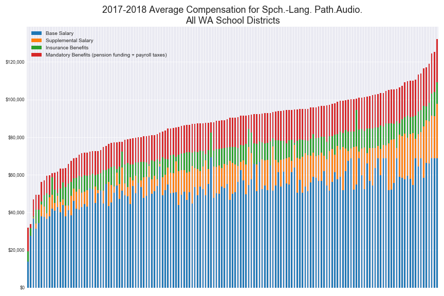
[ Show details for the top districts](pagesManual/DutyTitleCompensation/Average Compensation for Spch.-Lang. Path.Audio.Top 20 Districts.png "Spch.-Lang. Path.Audio. details at top districts")

___

Substitute Teacher
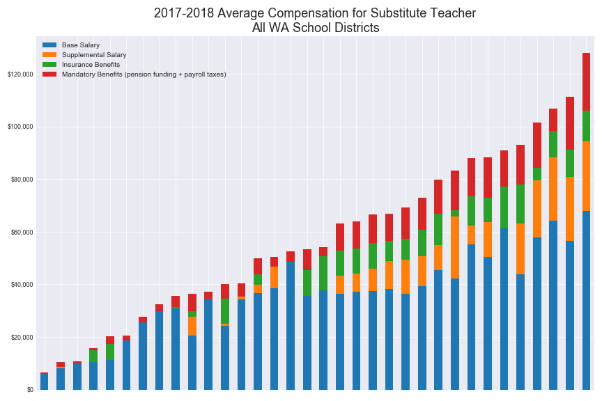
[ Show details for the top districts](pagesManual/DutyTitleCompensation/Average Compensation for Substitute TeacherTop 20 Districts.png "Substitute Teacher details at top districts")

___

Superintendent
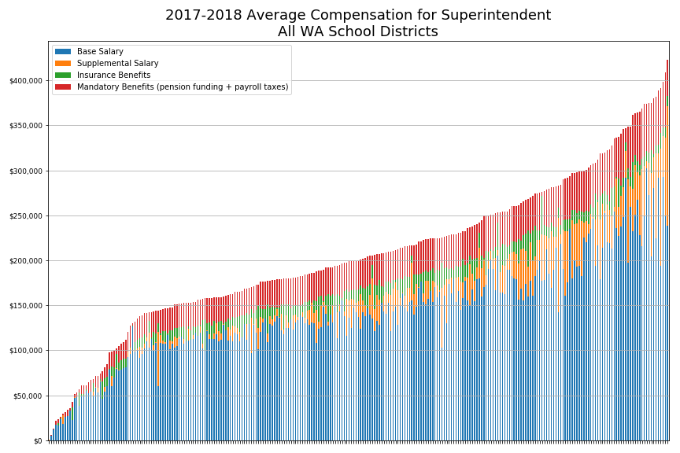
[ Show details for the top districts](pagesManual/DutyTitleCompensation/Average Compensation for SuperintendentTop 20 Districts.png "Superintendent details at top districts")

___

Technical
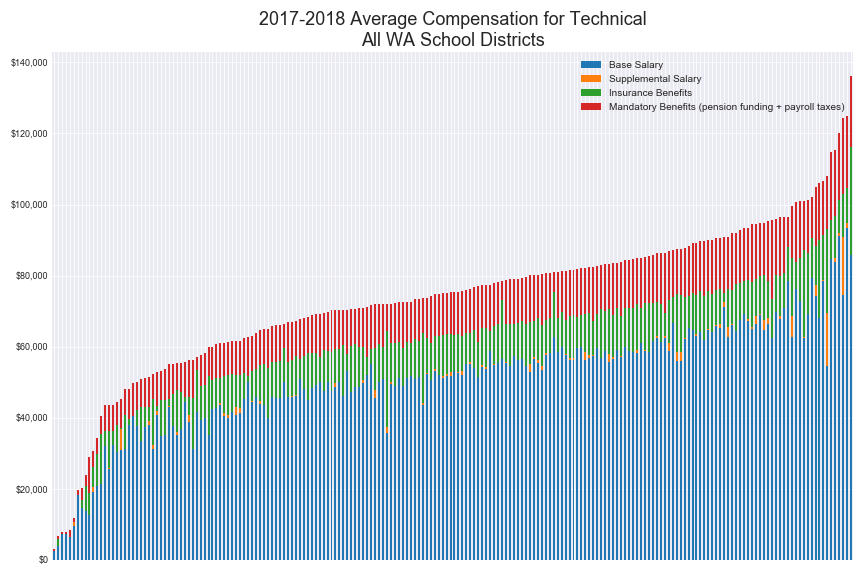
[ Show details for the top districts](pagesManual/DutyTitleCompensation/Average Compensation for TechnicalTop 20 Districts.png "Technical details at top districts")
