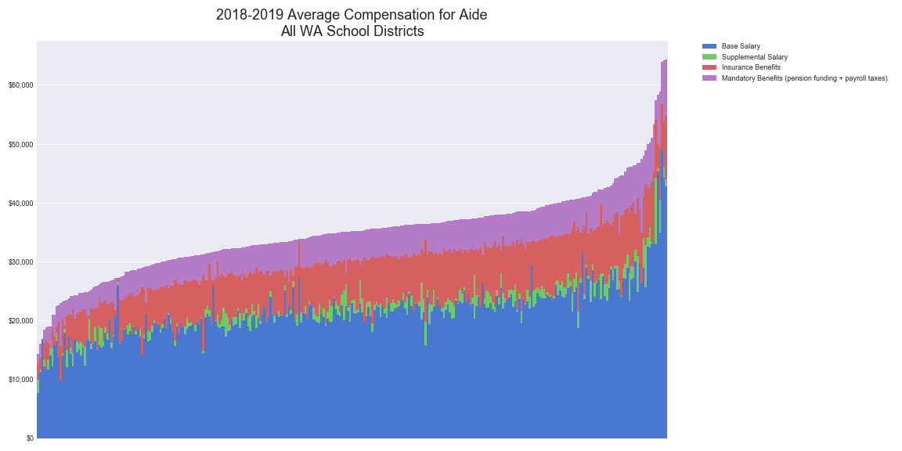
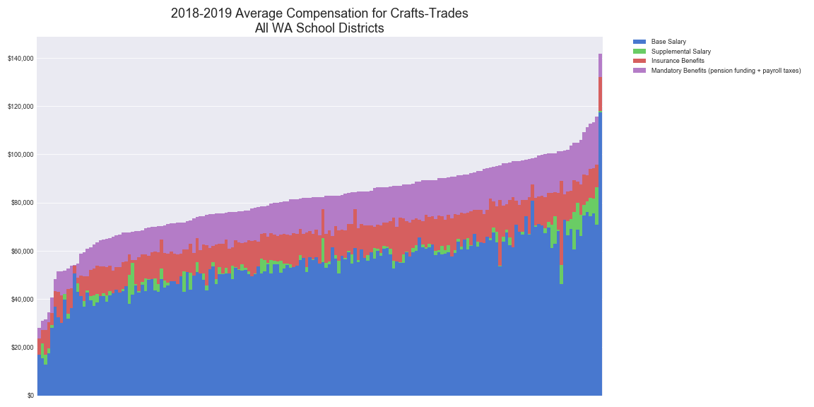
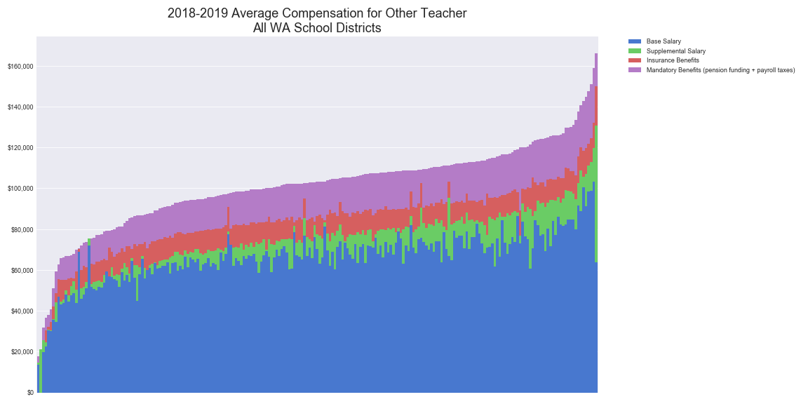
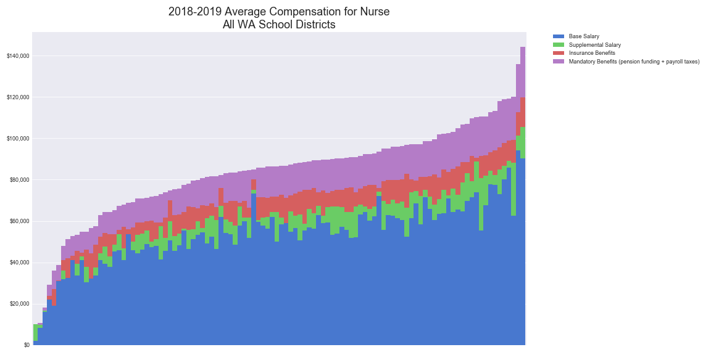
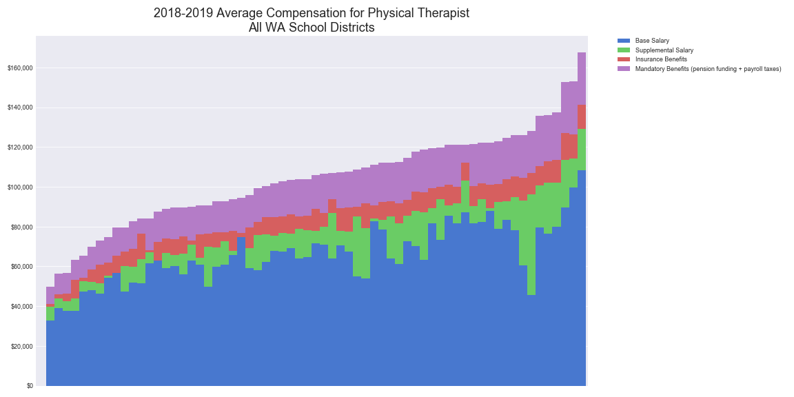
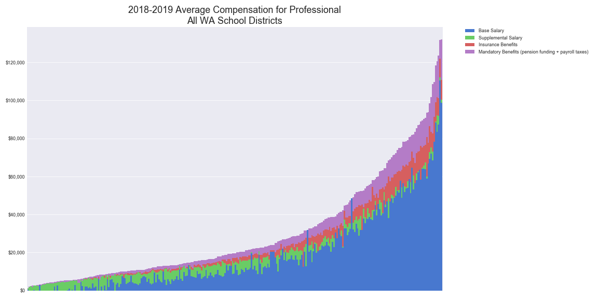
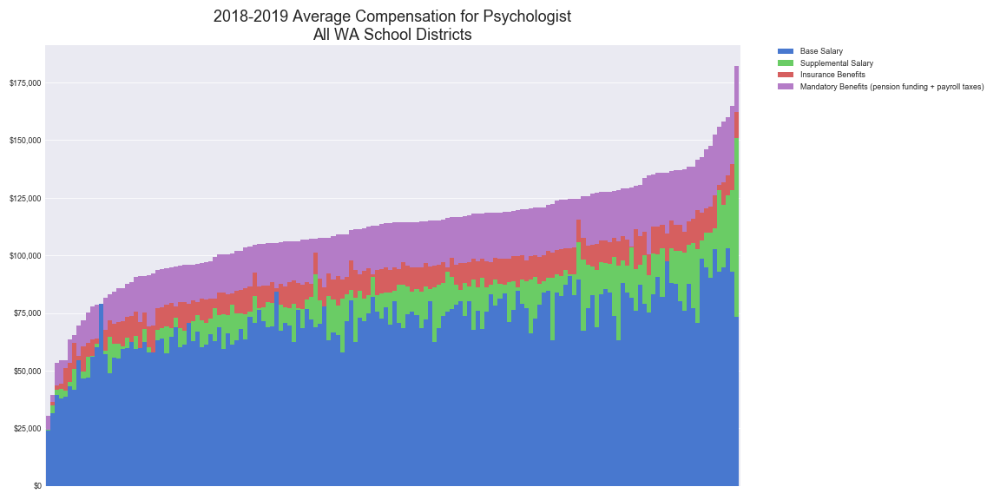
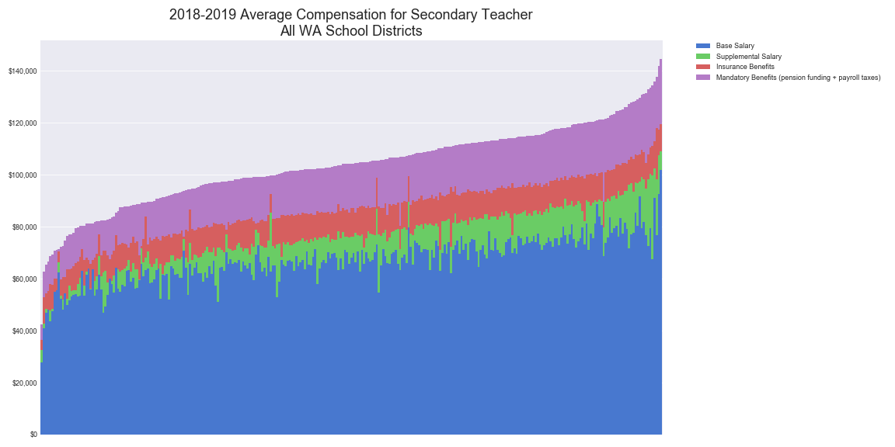
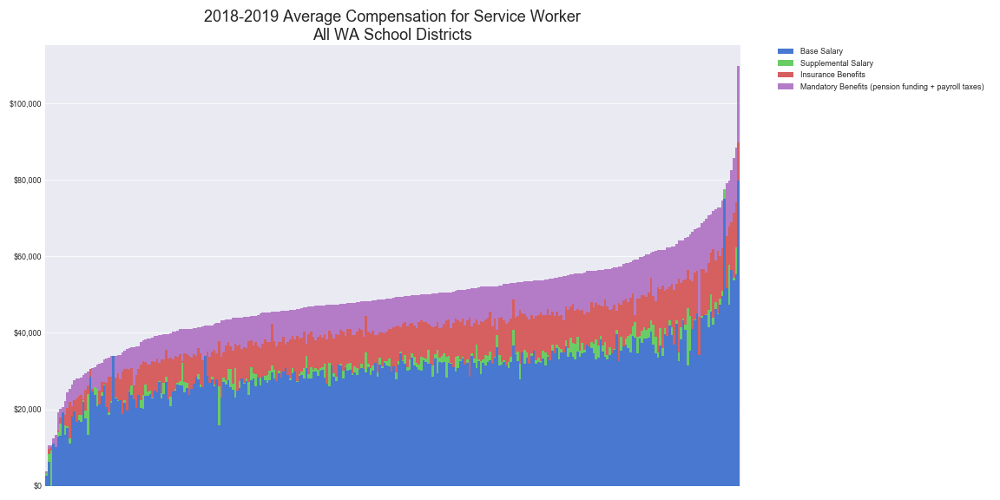
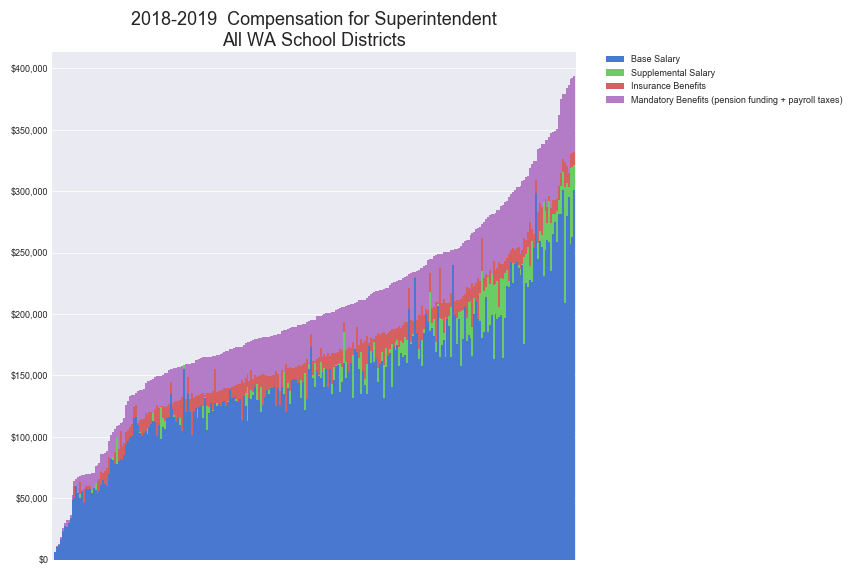

Average compensation for the specified duty title for all WA school districts.

Note: Each bar in the charts below represents one of the WA school districts with one or more personnel for the respective duty title.

___

Aide

___

Crafts-Trades

___

Contractor Teacher

___

Counselor

___

Deputy-Assist. Supt.

___

Director-Supervisor

___

Elem. Homeroom Teacher

___

Elem. Specialist Teacher

___

Elem. Vice Principal

___

Elementary Principal

___

Extracurricular

___

Laborer

___

Library Media Specialist

___

Occupational Therapist

___

Office-Clerical

___

Operator

___

Other District Admin.

___

Other School Admin.

___

Other Support Personnel

___

Other Teacher

___

Nurse

___

Physical Therapist

___

Professional

___

Psychologist

___

Reading Resource Spec.

___

Secondary Principal

___

Secondary Vice Principal

___

Secondary Teacher

___

Service Worker

___

Social Worker

___

Spch.-Lang. Path.Audio.

___

Substitute Teacher

___

Superintendent

___

Technical

