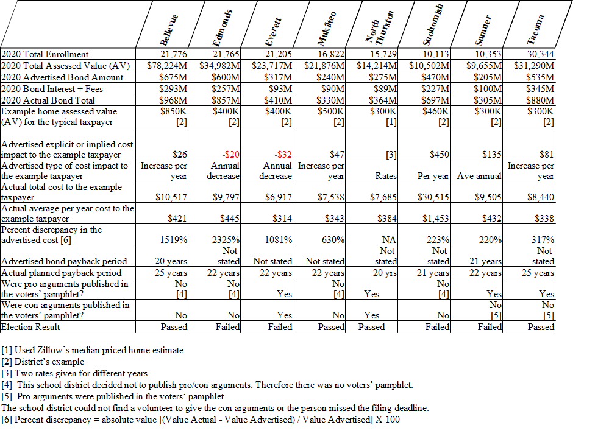
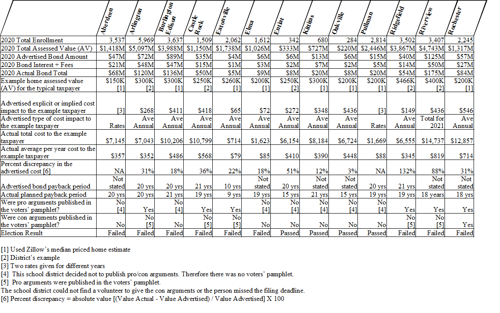
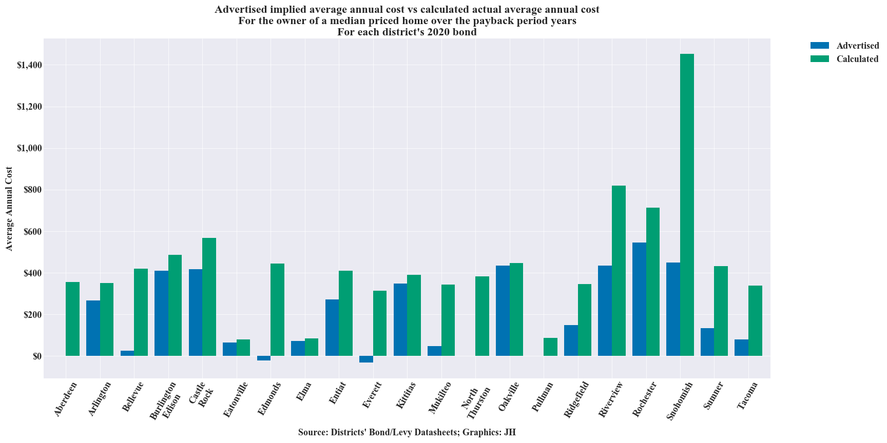
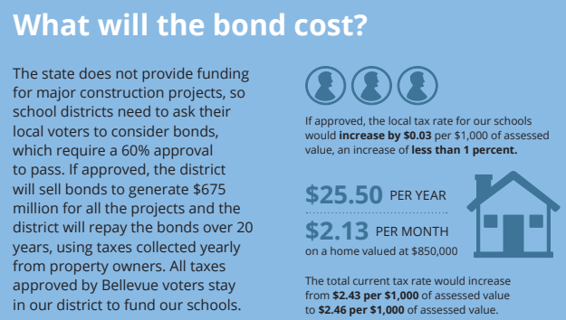
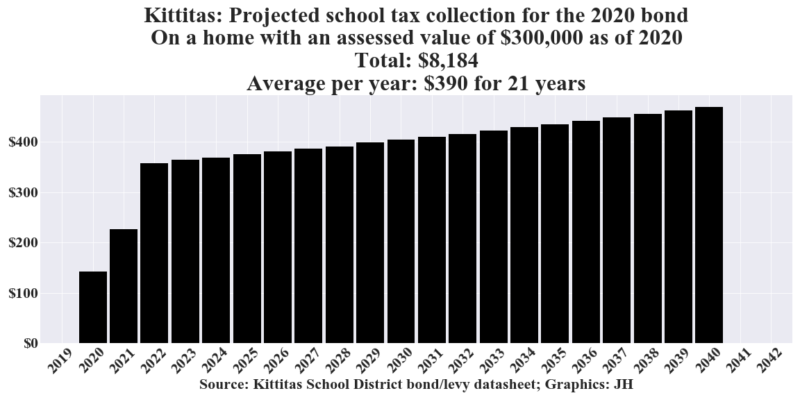

There were 21 school districts in WA that had a school bond on the ballot in 2020. This report focuses on the advertised cost and the analyzed actual cost to the local taxpayer for those bonds.

## Contents
- Summary table: Large districts (More than 10,000 students)
- Summary table: Small districts (Fewer than 10,000 students)
- Summary chart: Bond cost comparison of advertised costs vs actual costs
- Advertised cost vs calculated actual cost for each district
- Methodology

___

## Summary table: Large districts (More than 10,000 students)

___

## Summary table: Small districts (Fewer than 10,000 students)

___

## Summary chart: Bond cost comparison of advertised costs vs actual costs

___
## Advertised cost vs calculated actual cost for each district

___

## Aberdeen
### Bond cost to taxpayers as represented by the school district

### Bond cost to taxpayers as calculated by the authors

___

## Arlington
### Bond cost to taxpayers as represented by the school district

### Bond cost to taxpayers as calculated by the authors

___

## Bellevue
### Bond cost to taxpayers as represented by the school district

### Bond cost to taxpayers as calculated by the authors

___

## Burlington Edison
### Bond cost to taxpayers as represented by the school district

### Bond cost to taxpayers as calculated by the authors

___

## Castle Rock
### Bond cost to taxpayers as represented by the school district

### Bond cost to taxpayers as calculated by the authors

___

## Eatonville
### Bond cost to taxpayers as represented by the school district

### Bond cost to taxpayers as calculated by the authors

___

## Edmonds
### Bond cost to taxpayers as represented by the school district

### Bond cost to taxpayers as calculated by the authors

___

## Elma
### Bond cost to taxpayers as represented by the school district

### Bond cost to taxpayers as calculated by the authors

___

## Entiat
### Bond cost to taxpayers as represented by the school district

### Bond cost to taxpayers as calculated by the authors

___

## Everett
### Bond cost to taxpayers as represented by the school district

### Bond cost to taxpayers as calculated by the authors

___

## Kittitas
### Bond cost to taxpayers as represented by the school district

### Bond cost to taxpayers as calculated by the authors

___

## Mukilteo
### Bond cost to taxpayers as represented by the school district

### Bond cost to taxpayers as calculated by the authors

___

## North Thurston
### Bond cost to taxpayers as represented by the school district

### Bond cost to taxpayers as calculated by the authors

___

## Oakville
### Bond cost to taxpayers as represented by the school district

### Bond cost to taxpayers as calculated by the authors

___

## Pullman
### Bond cost to taxpayers as represented by the school district

### Bond cost to taxpayers as calculated by the authors

___

## Ridgefield
### Bond cost to taxpayers as represented by the school district

### Bond cost to taxpayers as calculated by the authors

___

## Riverview
### Bond cost to taxpayers as represented by the school district

### Bond cost to taxpayers as calculated by the authors

___

## Rochester
### Bond cost to taxpayers as represented by the school district

### Bond cost to taxpayers as calculated by the authors

___

## Snohomish
### Bond cost to taxpayers as represented by the school district

### Bond cost to taxpayers as calculated by the authors

___

## Sumner
### Bond cost to taxpayers as represented by the school district

### Bond cost to taxpayers as calculated by the authors

___

## Tacoma
### Bond cost to taxpayers as represented by the school district

### Bond cost to taxpayers as calculated by the authors

___

## Methodology
For this analysis, the annual assessed value (AV) growth rates (increases or decreases) for the example property owners' properties were set to the same values as the Total AV Growth Rates that their respective districts used in their projections in their levy and bond datasheets.

New homes, apartments, and businesses that come on the market in the future at some point over the payback period of the bond are not taken into account. These would add to the tax base and potentially lower the bond payback obligation to the existing property owners.

Since, in this methodology and its assumptions, the existing properties' AVs all track the Total AV, it doesn't matter if all properties increase in AV by 10% or all decrease in AV by 10% (which could happen in a recession). The tax collection schedule shown in the charts would still apply for the example homeowner. The example homeowner's proportion of obligation for the bond debt remains the same over the payback period. Tax rates, however, would change. If all properties increase in AV by 10%, the tax rate for this bond would decrease by 10%. If all properties decrease in AV by 10%, the tax rate for this bond wound increase by 10%.
