## 2017-2018 Dual Credit Course Participation
### (All Students, Low-Income, Students with Disabilities)
- Advanced Placement
- Cambridge
- College in the High School
- CTE Dual Credit
- International Baccalaureate
- Running Start

___

Advanced Placement

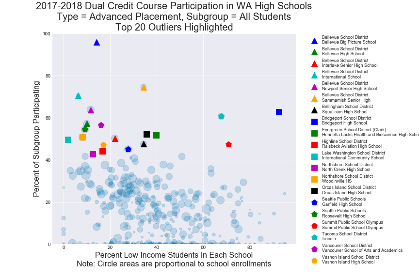

___

Cambridge

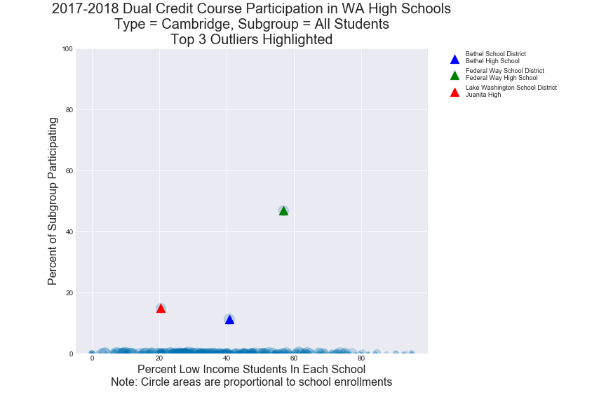
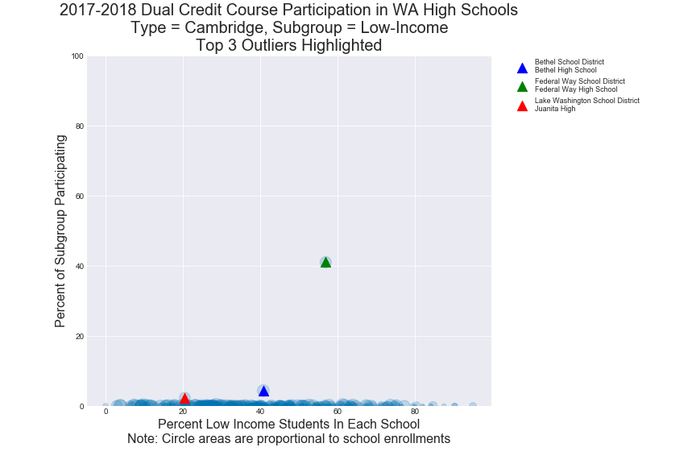
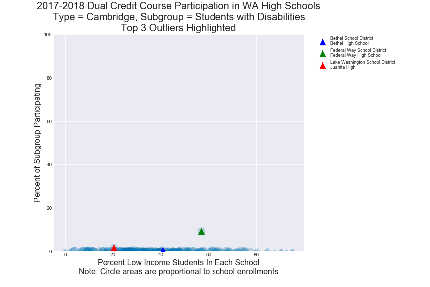

___

College in the High School

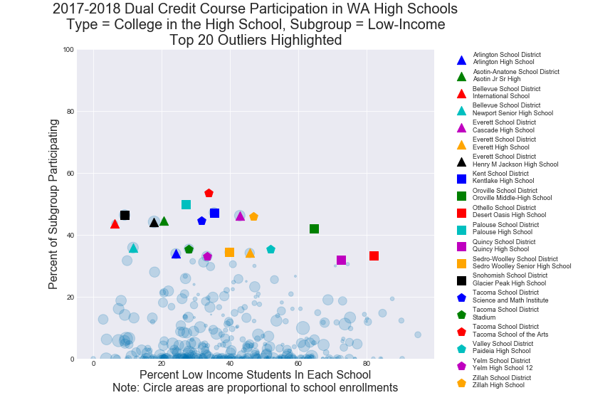
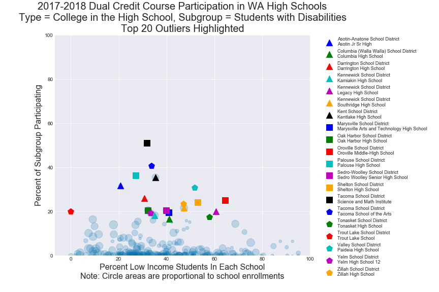

___

CTE Dual Credit

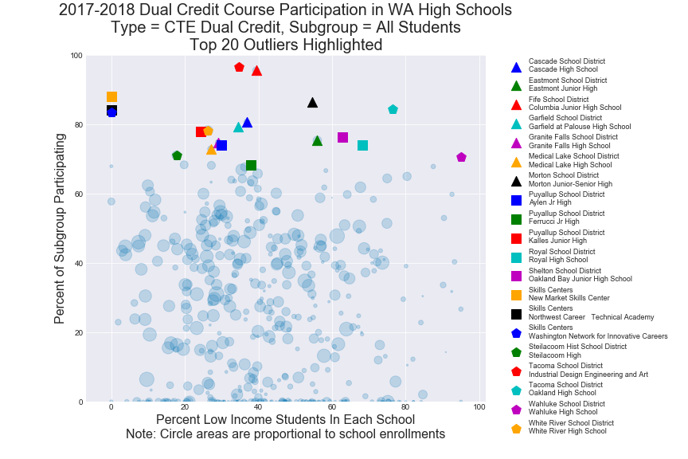
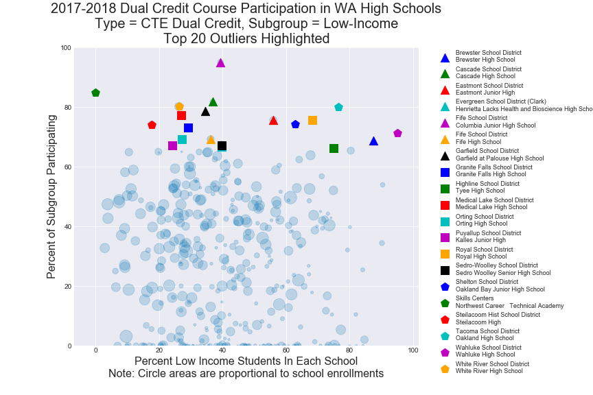
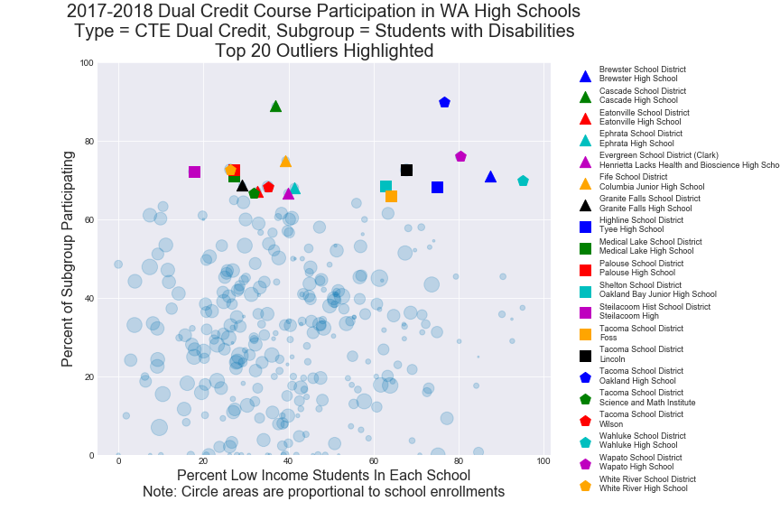

___

International Baccalaureate

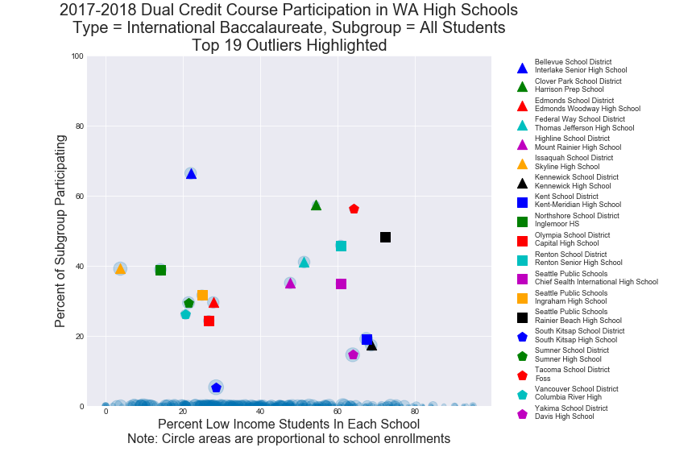
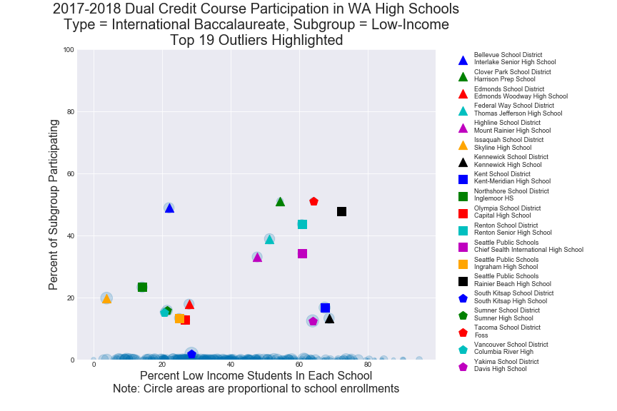
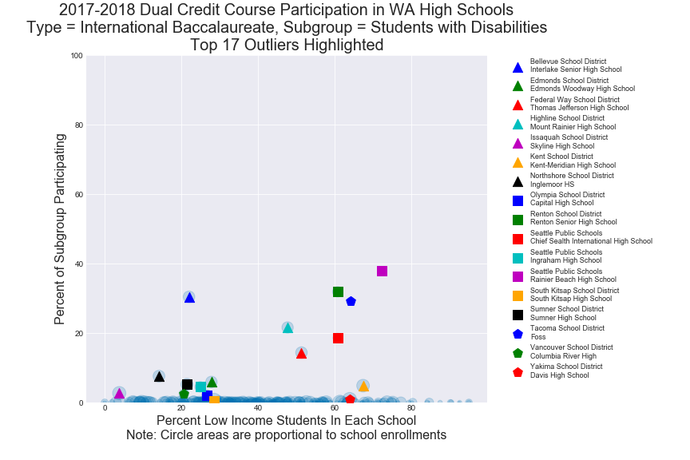

___

Running Start

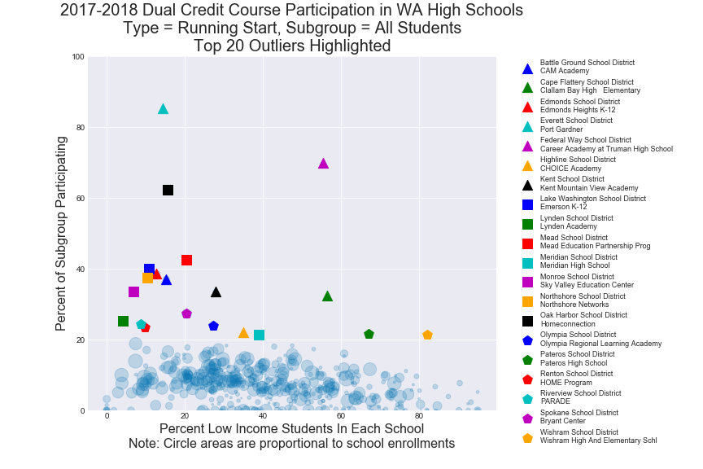
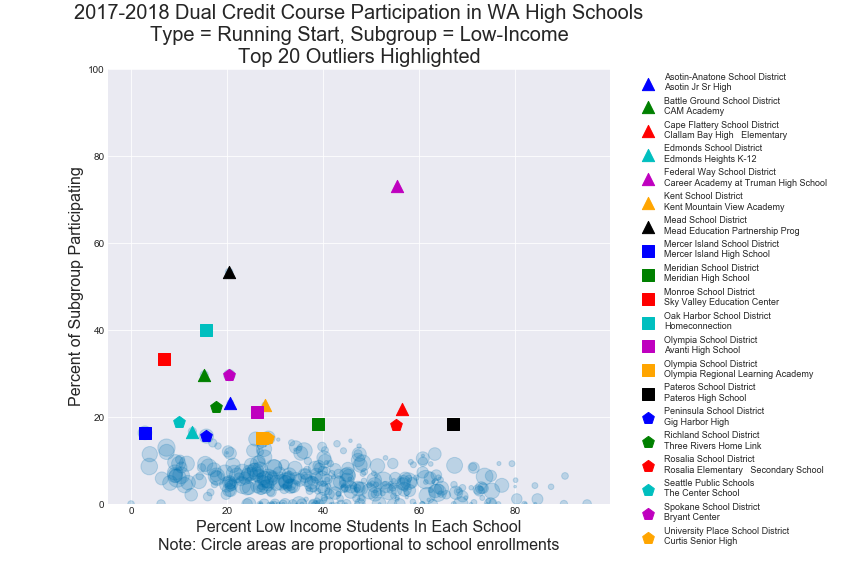
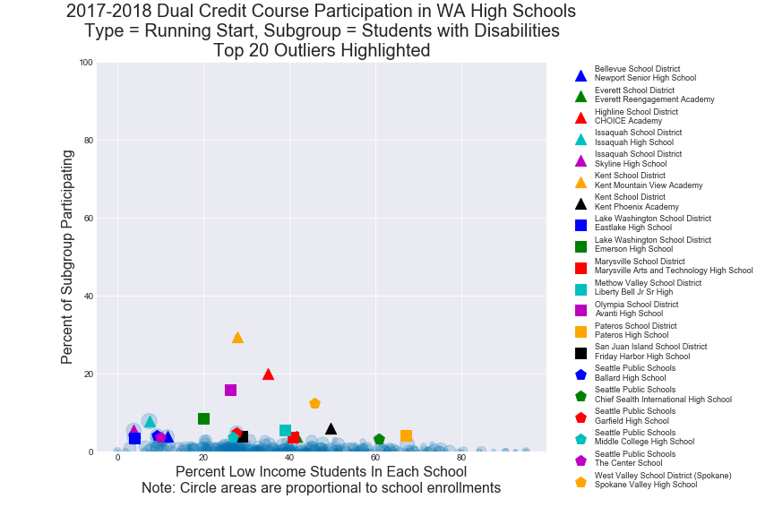

