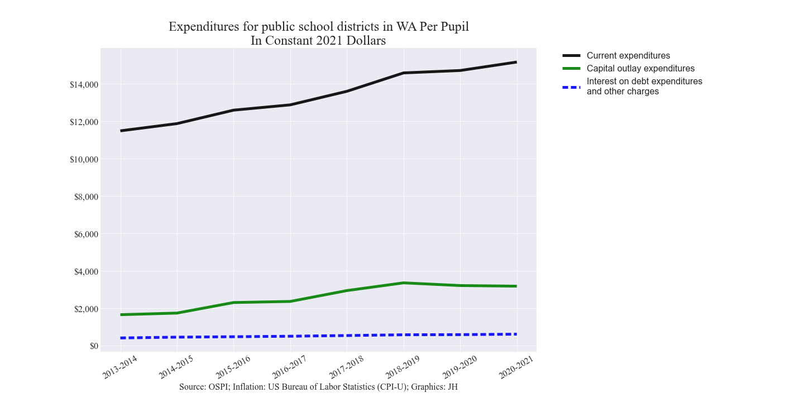
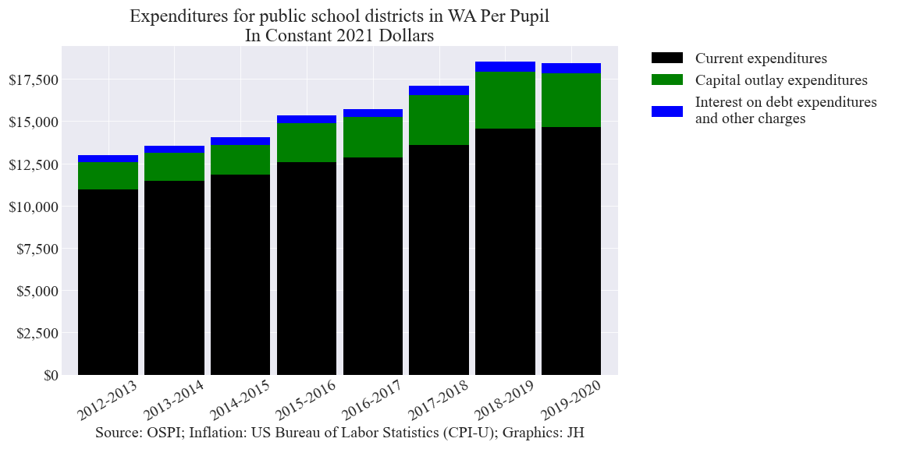
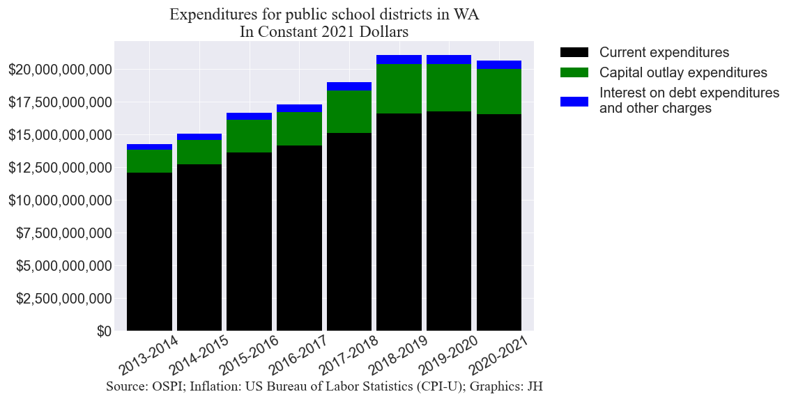
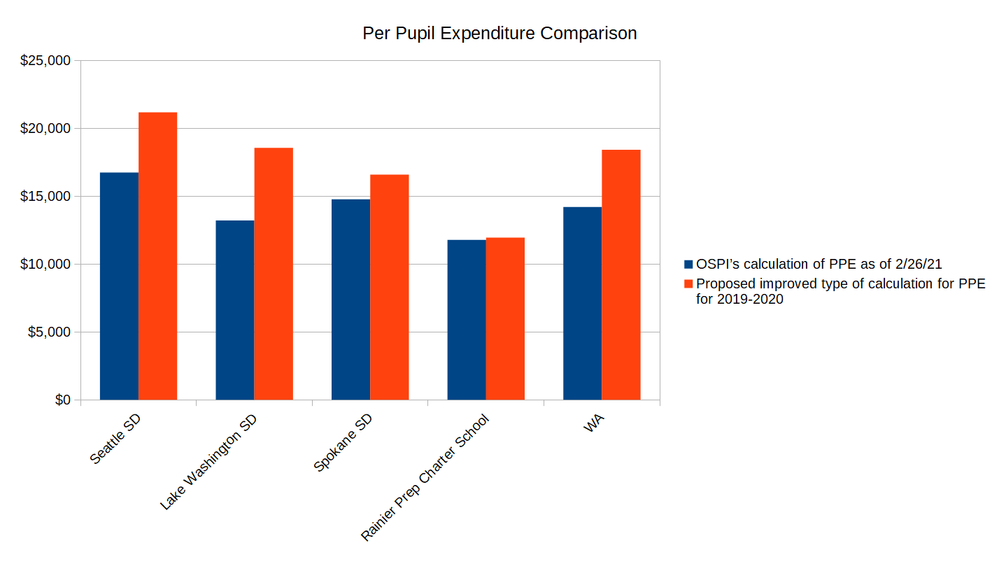
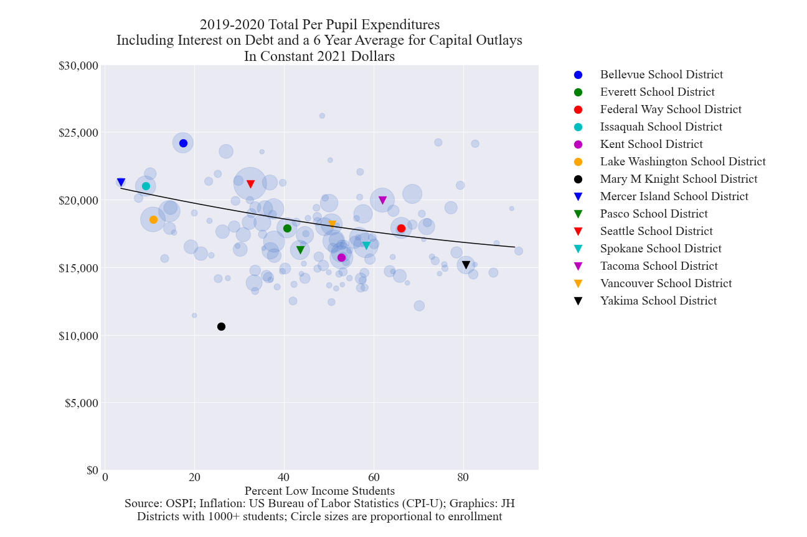
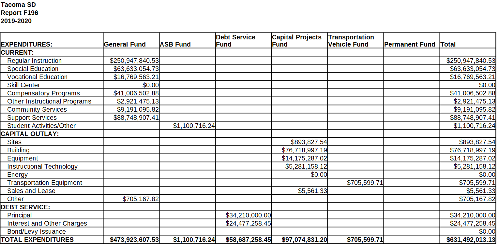

This report focuses on school district expenditures. WA's school districts and the OSPI (Washington Office of Superintendent of Public Instruction) generally underreport per pupil expenditures (PPE) since they exclude 
capital outlays and interest on debt in their calculations. A recommended improved definition of per pupil expenditures is used in the following analysis 
that is similar to the definition used by the NCES (National Center for Education Statistics).

## Contents
- Per pupil expenditures for public school districts in WA in constant 2021 dollars (Line chart)
- Per pupil expenditures for public school districts in WA in constant 2021 dollars (Stacked bar chart)
- Expenditures for public school districts in WA in constant 2021 dollars (Stacked bar chart)
- Per pupil expenditure comparison
- Per pupil expenditures (including capital outlays and interest on debt) for public school districts in WA with enrollments of 1,000+ students in constant 2021 dollars (Interactive scatter chart)
- Student to teacher ratios for public school districts in WA (Interactive scatter chart)
- NCES (National Center for Education Statistics) information
- Appendix

___

## Per pupil expenditures for public school districts in WA in constant 2021 dollars (Line chart)

___

## Per pupil expenditures for public school districts in WA in constant 2021 dollars (Stacked bar chart)

___

## Expenditures for public school districts in WA in constant 2021 dollars (Stacked bar chart)

___

## Per pupil expenditure comparison

___

## Per pupil expenditures (including capital outlays and interest on debt) for public school districts in WA with enrollments of 1,000+ students in constant 2021 dollars (Interactive scatter chart)

<!---

-->


### Tips on using the interactive capabilities:
- As you hover your mouse over a bubble, pertinent details are displayed.
- As you hover your mouse over any part of the chart, a special menu of icons appears just above the chart. 
- There are icons to zoom in and out, or zoom into a rectangular area.
- There are icons to pan, auto scale and to reset the axes.
- The legend is active and offers the ability to filter the districts displayed by county.
- To remove all bubbles from the chart except for those for one county, double click (2 rapid mouse clicks) on the county name in the legend.
- You can also toggle on additional counties one at a time by a single click on the county names in the legend of the additional counties of interest.
- If you want all counties on, double click any county in the legend that is off.

___

## Student to teacher ratios for public school districts in WA (Interactive scatter chart)



### Note
- Student-to-Teacher Ratio represents the total distinct count of students enrolled in the organization on October 1st of the given school year divided by the total distinct number of classroom teachers in the organization.

___

## NCES (National Center for Education Statistics) information

[NCES](https://nces.ed.gov/fastfacts/display.asp?id=66)

___

## Appendix
For this analysis:

- Current expenditures are made up of all of the expenditures defined as Current in the OSPI's F196 report. The term "Current" 
in this context is a government accounting term used to describe expenditures on goods and services normally consumed in the current year.
    - Regular Instruction
    - Special Education
    - Vocational Education
    - Skills Center
    - Compensatory Programs
    - Other Instructional Programs
    - Community Services
    - Support Services
    - Student Activities/Other
- Capital outlay expenditures are made up of the expenditures defined as Capital Outlay in the F196 report
    - Sites
    - Building
    - Equipment
    - Instructional Technology
    - Energy
    - Sales and Lease
    - Transportation Equipment
    - Other
- Interest on debt expenditures and other charges are made up of the following items listed as Debt Service in the OSPI's F196 report
    - Interest and Other Charges
    - Bond/Levy Issuance and/or Election
- Inflation data source: U.S. Bureau of Labor Statistics. Consumer Price Index for All Urban Consumers (CPI-U)
- F196 report data example

___