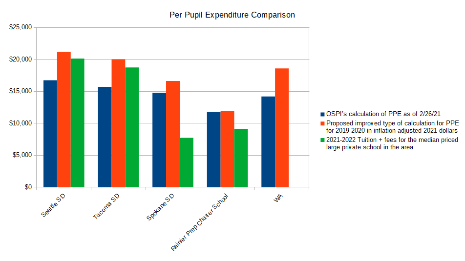

This report focuses on school district expenditures. WA's school districts and the OSPI (Washington Office of Superintendent of Public Instruction) generally underreport per pupil expenditures (PPE) since they exclude 
capital outlays and interest on debt in their calculations. A recommended improved definition of per pupil expenditures is used in the following analysis 
that is similar to the definition used by the NCES (National Center for Education Statistics).

## Contents
- Expenditures for public school districts in WA per pupil in constant 2021 dollars (Line chart)
- Expenditures for public school districts in WA per pupil in constant 2021 dollars (Stacked bar chart)
- Expenditures for public school districts in WA in constant 2021 dollars (Stacked bar chart)
- Per pupil expenditure comparison
- NCES (National Center for Education Statistics) information
- Notes

___

## Expenditures for public school districts in WA per pupil in constant 2021 dollars (Line chart)

___

## Expenditures for public school districts in WA per pupil in constant 2021 dollars (Stacked bar chart)

___

## Expenditures for public school districts in WA in constant 2021 dollars (Stacked bar chart)

___

## Per pupil expenditure comparison

___

## NCES (National Center for Education Statistics) information

[NCES](https://nces.ed.gov/fastfacts/display.asp?id=66)

___

## Notes
For this analysis:

- Current expenditures are made up of all of the expenditures defined as Current in the OSPI's F196 report. The term "Current" 
in this context is a government accounting term used to describe expenditures on goods and services normally consumed in the current year.
    - Regular Instruction
    - Special Education
    - Vocational Education
    - Skills Center
    - Compensatory Programs
    - Other Instructional Programs
    - Community Services
    - Support Services
    - Student Activities/Other
- Capital outlay expenditures are made up of the expenditures defined as Capital Outlay in the F196 report
    - Sites
    - Building
    - Equipment
    - Instructional Technology
    - Energy
    - Sales and Lease
    - Transportation Equipment
    - Other
- Interest on debt expenditures and other charges are made up of the following items listed as Debt Service in the OSPI's F196 report
    - Interest and Other Charges
    - Bond/Levy Issuance and/or Election
- Inflation data source: U.S. Bureau of Labor Statistics. Consumer Price Index for All Urban Consumers (CPI-U)
- F196 report data example

___