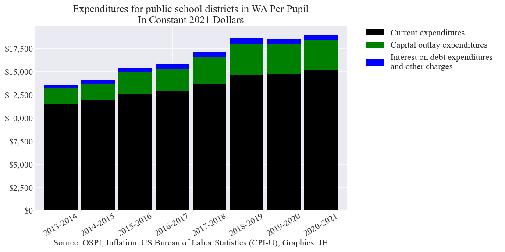

This report focuses on school district expenditures. WA's school districts and the OSPI (Washington Office of Superintendent of Public Instruction) generally underreport per pupil expenditures (PPE) since they exclude 
capital outlays and interest on debt in their calculations. A recommended improved definition of per pupil expenditures is used in the following analysis 
that is similar to the definition used by the NCES (National Center for Education Statistics).

## Contents
- Expenditures for public school districts in WA per pupil in constant 2021 dollars (Line chart)
- Expenditures for public school districts in WA per pupil in constant 2021 dollars (Stacked bar chart)
- Expenditures for public school districts in WA in constant 2021 dollars (Stacked bar chart)
- Per pupil expenditure comparison
- NCES (National Center for Education Statistics) information
- Notes

___

## Expenditures for public school districts in WA per pupil in constant 2021 dollars (Line chart)

___

## Expenditures for public school districts in WA per pupil in constant 2021 dollars (Stacked bar chart)

___

## Expenditures for public school districts in WA in constant 2021 dollars (Stacked bar chart)

___

## Per pupil expenditure comparison

___

## NCES (National Center for Education Statistics) information

[NCES](https://nces.ed.gov/fastfacts/display.asp?id=66)

___

## Notes

- Operational expenditures are made up of the General Fund Expenses + ASB Fund Expenses + Transportation Vehicle Fund Expenses
- Capital outlay expenditures are made up of the Capital Projects Fund Expenses. A 6 year rolling average was used for individual school districts shown in the PPE comparison chart.
- Interest on debt expenditures are made up of the Interest and Other Charges from the Debt Service Fund Expenses
- Inflation data source: U.S. Bureau of Labor Statistics. Consumer Price Index for All Urban Consumers (CPI-U)

___