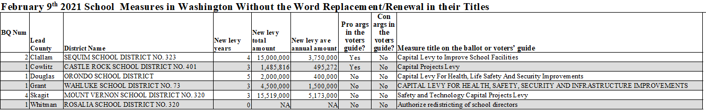

There are 60 school measures on the February 9th, 2021 ballot in Washington State. This report focuses on the levies advertised as replacement levies.

## Contents
- Summary
- Summary table: Levies advertised as replacements to previous levies
- Summary table: Measures not advertised as replacement levies
- Summary chart: Replacement levies in descending order by the actual increase in the levy amounts (1 of 2)
- Summary chart: Replacement levies in descending order by the actual increase in the levy amounts (2 of 2)
- Sources

___

## Summary

For the February 9th, 2021 special election:

There are 60 school measures in total from 50 school districts from 17 counties.

55 measures are advertised as replacement or renewal levies.

4 measures are advertised as non-replacement capital levies.

1 measure is a redistricting authorization measure and is not a levy.

37 of the replacement advertised levies involve an increase in the amount over the previous levy ranging from 3% to 115% more.

10 of the replacement advertised levies are the exact same in amount as the previous levy.

8 of the replacement advertised levies are lower in amount compared to the previous levy.

___

## Summary table: Levies advertised as replacements to previous levies

___

## Summary table: Levies advertised as non-replacements levies

___

## Summary chart: Replacement levies in descending order by the percent increase in the levy amounts

___

## Sources

Levy amounts and levy rates were obtained from current election and previous election sample ballots from each respective county elections department. 
Most counties had their sample ballots readily available on their websites.
For the fewer than 10 counties that did not, a public records request was made to obtain electronic copies.
