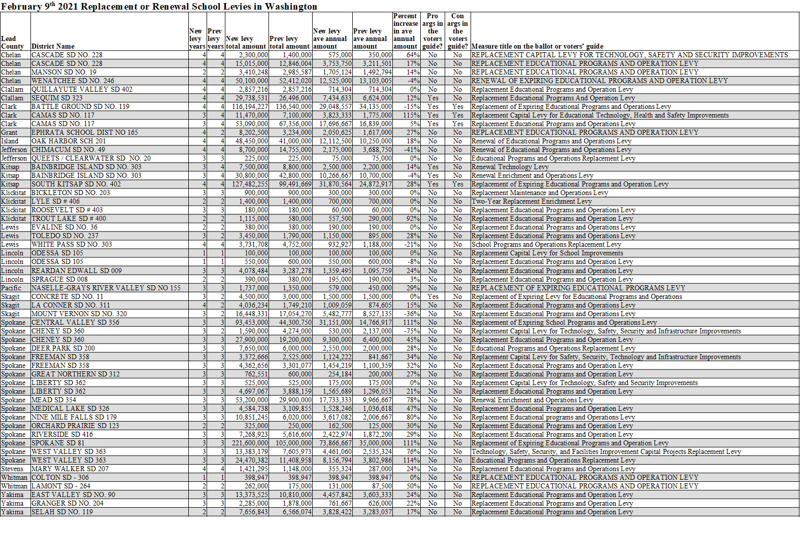
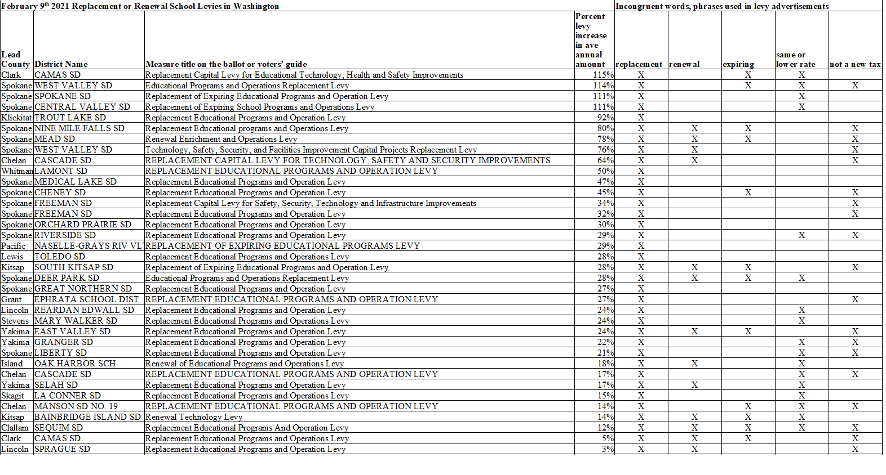

There are 60 school measures on the February 9th, 2021 ballot in Washington State. This report focuses on the levies advertised as replacement levies.

## Contents
- Summary
- Summary table: Levies advertised as replacements to previous levies
- Summary table: Measures without the words replacement or renewal in their titles
- Summary chart: Replacement levies in descending order by the percent increase in the levy amounts
- Summary table: Misleading words used in levy advertisements
- Example replacement levy advertisement: Quillayute Valley SD
- Example replacement levy advertisement: Spokane SD
- Methodology
- Sources

___

## Summary

For the February 9th, 2021 special election:

There are 60 school measures in total from 50 school districts from 17 counties.

54 measures are advertised as replacement or renewal levies.

5 measures are advertised as capital levies without the words replacement or renewal in their titles.

1 measure is a redistricting authorization measure and is not a levy.

36 of the replacement advertised levies involve an increase in the amount over the previous levy ranging from 3% to 115% more.

10 of the replacement advertised levies are the exact same in amount as the previous levy.

8 of the replacement advertised levies are lower in amount compared to the previous levy.

4 of the replacement advertised levies have shorter durations (fewer years) than their previous levy.

7 of the replacement advertised levies have longer durations (more years) than their previous levy.

42 measures used the words 'Educational Programs and Operations' in their titles.

3 measures used the word 'Enrichment' instead of EP&O in their titles.

1 measure used the words 'Maintenance and Operations' in their title.

___

## Summary table: Levies advertised as replacements to previous levies

___

## Summary table: Measures without the words replacement or renewal in their titles

___

## Summary chart: Replacement levies in descending order by the percent increase in the levy amounts

___

## Summary table: Misleading words used in levy advertisements

___

## Example replacement levy advertisement: Quillayute Valley SD

### The Quillayute Valley SD's levy advertisement snapshots relating to costs published on the district's website

[Quillayute SD's fact sheet website](https://www.qvschools.org/domain/1215 "Quillayute SD's fact sheet website")

[Quillayute SD's fact sheet snapshot](pagesManual/LeviesReport/QuallayuteValleySDLevyFactSheetSnapshot.png "Quillayute SD's advertisement snapshot")

### The authors' analysis of the Quillayute SD's replacement levy costs

___

## Example replacement levy advertisement: Spokane SD

### The Spokane SD's levy advertisement snapshots relating to costs published on the district's website

[Spokane SD's fact sheet website](https://www.spokaneschools.org/levyfaq "Spokane SD's fact sheet website")

[Spokane SD's fact sheet snapshot 1](pagesManual/LeviesReport/SpokaneLevyFactSheetSnapshot0.png "Spokane SD's advertisement snapshot 1")

[Spokane SD's fact sheet snapshot 2](pagesManual/LeviesReport/SpokaneLevyFactSheetSnapshot1.png "Spokane SD's advertisement snapshot 2")

[Spokane SD's fact sheet snapshot 3](pagesManual/LeviesReport/SpokaneLevyFactSheetSnapshot2.png "Spokane SD's advertisement snapshot 3")

[Spokane SD's fact sheet snapshot 4](pagesManual/LeviesReport/SpokaneLevyFactSheetSnapshot3.png "Spokane SD's advertisement snapshot 4")

### The authors' analysis of the Spokane SD's replacement levy costs

___

## Methodology

For this analysis, the annual assessed value (AV) growth rates for the example property owner's property were set to the same values as the Total District Levy AV Growth Rates. 
The effect of this assumption is that the obligated proportion of the levy for the example property remains constant for each year in the analysis. 
The Total District Levy AVs were calculated from the levy amounts and levy estimates obtained from the sample ballots.

The spreadsheet data and chart for the West Valley SD (Spokane) are shown below.

___

## Sources

Levy amounts and levy rates were obtained from current election and previous election sample ballots from each respective county elections department. 
10 counties had all their sample ballots readily available on their websites.
For the 7 counties that did not have either their current or past sample ballots online, a request was submitted to obtain electronic copies.

School districts' levy fact sheets and levy flyers posted on their official websites were reviewed for misleading words.

___
