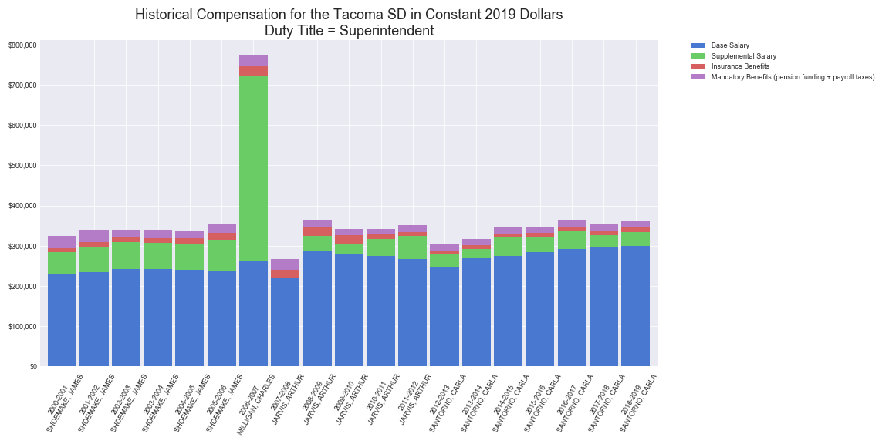
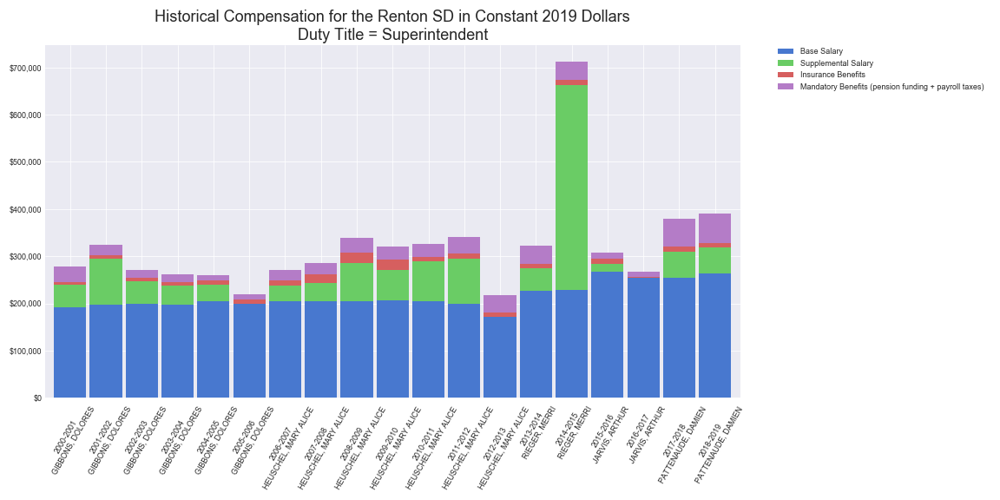
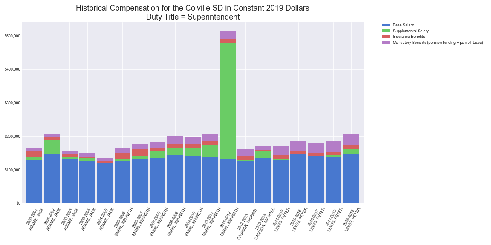
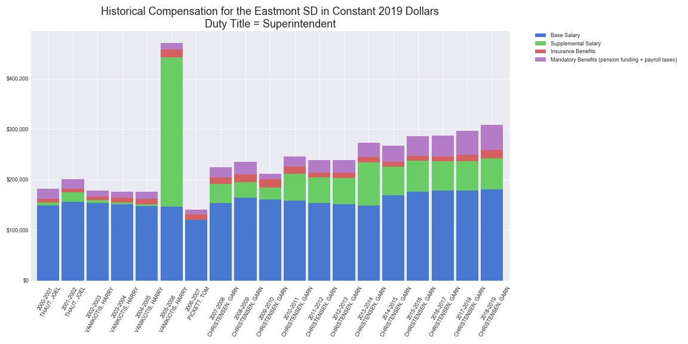
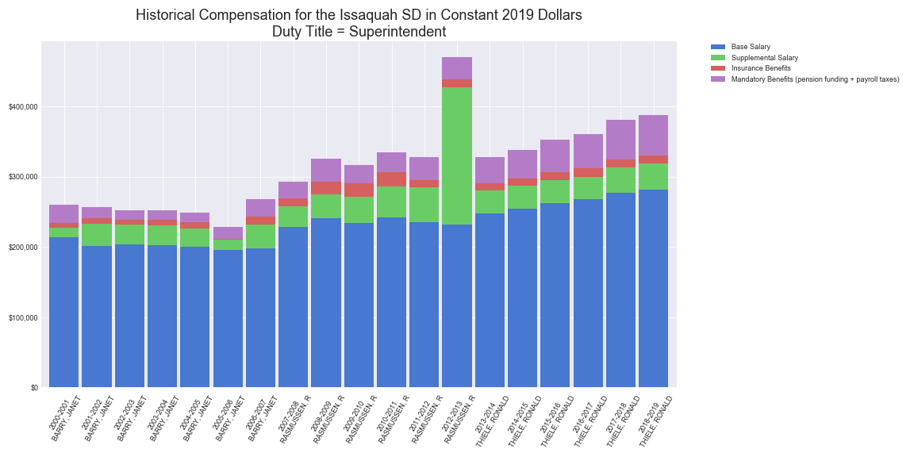
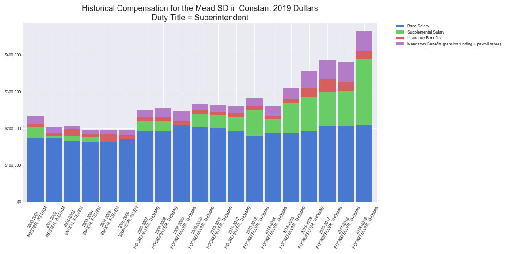
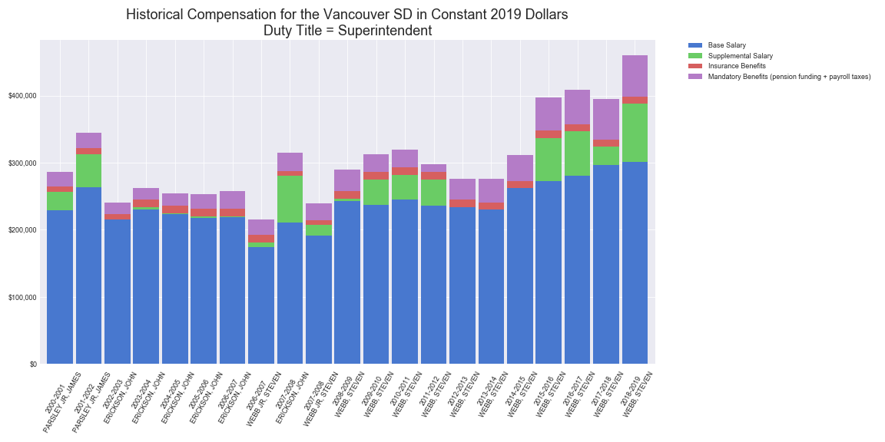
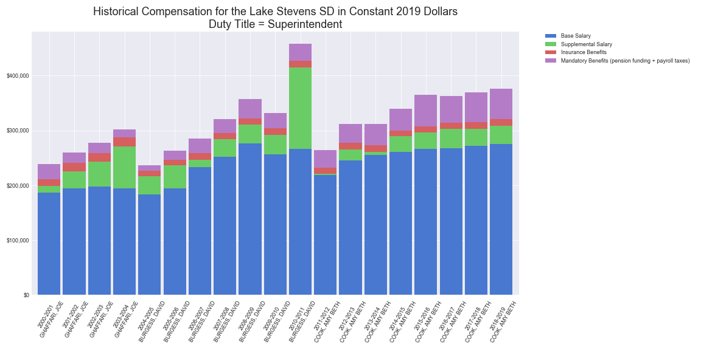

Constant 2019 dollars  
School year ranges: 2000/2001 to 2018/2019  
Source for CPI:  
[Bureau of Labor Statistics](https://data.bls.gov/cgi-bin/cpicalc.pl)

___

Tacoma

___

Renton

___

East Valley (Spokane)
 SD in Constant 2019 DollarsDuty Title = Superintendent.png "East Valley")

___

Colville

___

Evergreen (Clark)
 SD in Constant 2019 DollarsDuty Title = Superintendent.png "Evergreen")

___

Eastmont

___

Issaquah

___

Mead

___

Vancouver

___

Lake Stevens

___

